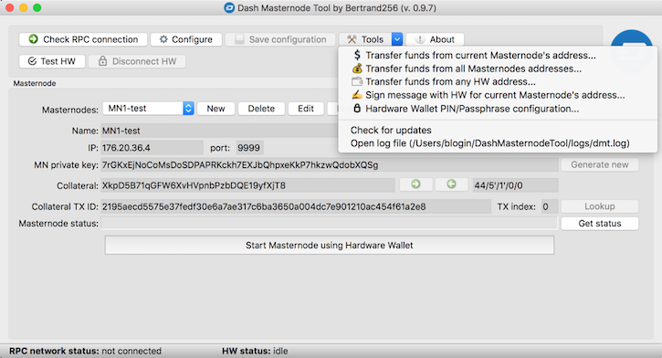

# Dash Masternode Tool (DMT)

## Masternodes

Dash masternodes are full nodes which are incentivized by receiving a share of the block reward as payment in return 
for the tasks they perform for the network, of which the most important include participation in *InstantSend* 
and *PrivateSend/CoinJoin* transactions. In order to run a masternode, apart from setting up a server which runs the 
software, you must dedicate 1000 Dash as *collateral*, which is *"tied up"* in your node as long as you want 
it to be considered a masternode by the network. It is worth mentioning that the private key controlling the 
funds can (and for security reasons, should) be kept separately from the masternode server itself.

A server with the Dash daemon software installed will operate as a Dash full node, but before the rest of the 
network accepts it as a legitimate masternode, one more thing must happen: the person controlling the node 
must prove that they also have control of the private key associated with the 1000 Dash *collateral* assigned to that node. This is achieved by sending a special transaction (i.e. ProRegTx) to the network, signed by the collateral private key.

Here you can see that certain key actions - like starting the masternode or changing some of its parameters - require access to the private key associated with the collateral. Although it can be stored within *Dash Core* wallet and thus allow to conveniently perform those activities, but for security reasons this is highly discouraged. A much better solution for most users will be to use a so-called hardware wallet that secures private keys from outside access, while giving the ability to perform certain operations related to those keys in a secure manner, i.e., controlled by the physical buttons of the device. 

Having such a device, the operations related to masternode management can be performed in two main ways:
 - using the *Dash Core* app - in this case, you have to take into account the necessity to execute several text commands from the Debug console; 
 - using additional apps, such as *Dash Masternode Tool*, where most operations can be performed graphically by simply clicking.  

## Dash Masternode Tool application

The main purpose of the application is to help you perform the most important operations related to registering and managing a masternode if the collateral is controlled by hardware wallets such as Trezor, Keepkey, Ledger.
In addition to these features, the application also allows you to perform some additional operations mainly related to Dash governance and hardware wallet setup&management.



## Configuration
In order to work properly, the application needs to communicate with the Dash network, which is done via so-called Dash RPC nodes. Technically, an RPC node is simply a running Dash Core or dashd program with the RPC API enabled. It does not matter whether it runs locally on the same computer as DMT or on some remote server on the Internet. All that matters is to ensure the network is properly configured, so that the RPC service is accessible from the computer you are running your DMT instance from.

### Network configuration
To make it as easy as possible for new users to use the application, it comes with a predefined network configuration for so-called "public" RPC nodes (nodes that are maintained by the DMT app developer). This is the default scenario after the first start of the application and in this case no additional actions are required. If you need to restore the default configuration (e.g. after user changes), take a look at this document: [Connection to "public" Dash RPC nodes](doc/config-connection-proxy.md).

For those who choose to use their own RPC nodes, here are two scenarios to achieve this:
 * [Direct connection to a local node](doc/config-connection-direct.md), for example to *Dash Core* running on your normal computer.
 * [Connection to a remote node through an SSH tunnel](doc/config-connection-ssh.md), if you want to work with a remote Dash daemon (like your masternode) through an SSH tunnel.
 

### Command line parameters
The application currently supports the following command-line parameters:
* `--data-dir`: a path to a directory in which the application will create all the needed files, such as: configuration file, cache and log files; it can be useful for users who want to avoid leaving any of the application files on the computer - which by default are created in the user's home directory - and instead to keep them on an external drive
* `--config`: a non-standard path to a configuration file. Example:
  `DashMasternodeTool.exe --config=C:\dmt-configs\config1.ini`

## Features

### Setting up a masternode
This is the main functionality of the *Dash Masternode Tool* application.

#### The steps of the entire process are: 
##### Step 1. [Selecting a VPS service](doc/selecting-a-vps-service.md)  
The basis of a masternode is a Dash daemon running on a server 24/7, having its own IP address reachable from the Internet. To ensure the required availability, the most optimal solution is to use a so-called Virtual Private Server (VPS) rented from a reliable service provider. While you can run the masternode daemon on your own server (even Rapberry Pi) and use your home internet connection to make it public, it's not very reliable in most cases, so in this documentation we will refer to that server simply as a VPS. If in your case, it will actually be a physical server, then all the steps described for installing software on it will still be valid.

##### Step 2. Installing and configuring a Dash node
After obtaining the appropriate VPS service, it is necessary to install (and properly configure) the software that will make up the Dash node being the basis of the masternode.

In this documentation, we will focus on two scenarios of such installation:  
 * [manual installation of the Dash node](doc/installing-dash-node-manual.md)
 * [automatic installation of the Dash node using Ansible](doc/installing-dash-node-ansible.md)

##### Step 3. [Preparing a *collateral transaction*](doc/preparing-collateral-transaction.md)
For masternode registration it is necessary to prepare a so-called collateral transaction in advance by sending 1000 Dash to one of the addresses from your own hardware wallet.

##### Step 4. [Registering a masternode](doc/registering-masternode.md)
Masternode registration is the act of broadcasting to the Dash network that we have a node configured to act as a Dash masternode.

### Updating the masternode payout address
This topic is covered [here](doc/other-features.md#updating-the-masternode-payout-address).

### Updating the masternode operator key
This topic is covered [here](doc/other-features.md#updating-the-masternode-operator-key).

### Updating the masternode voting key
This topic is covered [here](doc/other-features.md#updating-the-masternode-voting-key).

### Updating the masternode IP, port and operator payout address
This topic is covered [here](doc/other-features.md#updating-the-masternode-ip-port-and-operator-payout-address).

### Revoking masternode 
This topic is covered [here](doc/other-features.md#revoking-masternode).

### Wallet

In general, this functionality is a graphical interface to hardware wallets, the main task of which is to send funds to specified addresses. It therefore implements functions similar to those provided by official device manufacturers' applications, but has a few additional features that can be quite important for masternode owners:
* hiding by default collateral transactions to protect them from accidental spending and thus dostroying the associated masternode;
* the ability to send UTXOs (aka coins) of a new transaction type (DIP-3) which is not supported by all official vendor applications.

This topic is covered [here](doc/wallet.md).

### Voting on proposals
Voting on proposals is a very important part of Dash governance, as it provides funding for both the core of the project (the work of the Dash Core Group) and community-led side projects to support the entire ecosystem.

This topic is covered [here](doc/proposals.md).

### Signing messages with masternode private keys
This topic is covered [here](doc/other-features.md#signing-messages-with-masternode-private-keys).

### Signing messages with hardware wallets
This topic is covered [here](doc/other-features.md#signing-messages-with-hardware-wallets).

### Changing the hardware wallets settings
This topic is covered [here](doc/other-features.md#changing-the-hardware-wallets-settings).

### Restoring hardware wallets from recovery seed
The topic is covered [here](doc/hw-recovery.md).

### Hardware wallet initialization with newly generated seed
The topic is covered [here](doc/hw-initialization.md).

### Wiping hardware wallet
The topic is covered [here](doc/hw-wiping.md).
  
## Hardware wallets

### Supported hardware wallets

- [x] Trezor (model One and T)
- [x] KeepKey
- [x] Ledger Nano (mode S and X)

### Linux udev rules for hardware wallets
In order for USB devices to be properly recognized under Linux, their so-called udev rules have to be added. As hardware wallets are USB devices, this also applies to them.
Below is a list of commands that add udev rules for hardware wallets supported by this application, i.e. Trezor, Keepkey and Ledger. If, after installing them, you have a problem with the correct detection of the device, look for the appropriate rules on the manufacturer's website.

**Trezor**:
```
echo 'SUBSYSTEM=="usb", ATTR{idVendor}=="534c", ATTR{idProduct}=="0001", MODE="0660", GROUP="plugdev", TAG+="uaccess", TAG+="udev-acl", SYMLINK+="trezor%n"' | sudo tee /etc/udev/rules.d/51-trezor-udev.rules
echo 'KERNEL=="hidraw*", ATTRS{idVendor}=="534c", ATTRS{idProduct}=="0001", MODE="0660", GROUP="plugdev", TAG+="uaccess", TAG+="udev-acl"' | sudo tee -a /etc/udev/rules.d/51-trezor-udev.rules
echo 'SUBSYSTEM=="usb", ATTR{idVendor}=="1209", ATTR{idProduct}=="53c0", MODE="0660", GROUP="plugdev", TAG+="uaccess", TAG+="udev-acl", SYMLINK+="trezor%n"' | sudo tee -a /etc/udev/rules.d/51-trezor-udev.rules
echo 'SUBSYSTEM=="usb", ATTR{idVendor}=="1209", ATTR{idProduct}=="53c1", MODE="0660", GROUP="plugdev", TAG+="uaccess", TAG+="udev-acl", SYMLINK+="trezor%n"' | sudo tee -a /etc/udev/rules.d/51-trezor-udev.rules
echo 'KERNEL=="hidraw*", ATTRS{idVendor}=="1209", ATTRS{idProduct}=="53c1", MODE="0660", GROUP="plugdev", TAG+="uaccess", TAG+="udev-acl"' | sudo tee -a /etc/udev/rules.d/51-trezor-udev.rules
sudo udevadm trigger
sudo udevadm control --reload-rules
```

**KeepKey**:
```
echo 'SUBSYSTEM=="usb", ATTR{idVendor}=="2b24", ATTR{idProduct}=="0001", MODE="0666", GROUP="plugdev", TAG+="uaccess", TAG+="udev-acl", SYMLINK+="keepkey%n"' | sudo tee /etc/udev/rules.d/51-usb-keepkey.rules
echo 'KERNEL=="hidraw*", ATTRS{idVendor}=="2b24", ATTRS{idProduct}=="0001",  MODE="0666", GROUP="plugdev", TAG+="uaccess", TAG+="udev-acl"' | sudo tee -a /etc/udev/rules.d/51-usb-keepkey.rules
echo 'SUBSYSTEM=="usb", ATTR{idVendor}=="2b24", ATTR{idProduct}=="0002", MODE="0666", GROUP="plugdev", TAG+="uaccess", TAG+="udev-acl", SYMLINK+="keepkey%n"' | sudo tee -a /etc/udev/rules.d/51-usb-keepkey.rules
echo 'KERNEL=="hidraw*", ATTRS{idVendor}=="2b24", ATTRS{idProduct}=="0002",  MODE="0666", GROUP="plugdev", TAG+="uaccess", TAG+="udev-acl"' | sudo tee -a /etc/udev/rules.d/51-usb-keepkey.rules
sudo udevadm trigger
sudo udevadm control --reload-rules
```

**Ledger Nano**:
```
echo 'SUBSYSTEMS=="usb", ATTRS{idVendor}=="2581", ATTRS{idProduct}=="1b7c|2b7c|3b7c|4b7c", TAG+="uaccess", TAG+="udev-acl"' | sudo tee /etc/udev/rules.d/20-hw1.rules
echo 'SUBSYSTEMS=="usb", ATTRS{idVendor}=="2c97", ATTRS{idProduct}=="0000|0000|0001|0002|0003|0004|0005|0006|0007|0008|0009|000a|000b|000c|000d|000e|000f|0010|0011|0012|0013|0014|0015|0016|0017|0018|0019|001a|001b|001c|001d|001e|001f", TAG+="uaccess", TAG+="udev-acl"' | sudo tee -a /etc/udev/rules.d/20-hw1.rules
echo 'SUBSYSTEMS=="usb", ATTRS{idVendor}=="2c97", ATTRS{idProduct}=="0001|1000|1001|1002|1003|1004|1005|1006|1007|1008|1009|100a|100b|100c|100d|100e|100f|1010|1011|1012|1013|1014|1015|1016|1017|1018|1019|101a|101b|101c|101d|101e|101f", TAG+="uaccess", TAG+="udev-acl"' | sudo tee -a /etc/udev/rules.d/20-hw1.rules
echo 'SUBSYSTEMS=="usb", ATTRS{idVendor}=="2c97", ATTRS{idProduct}=="0002|2000|2001|2002|2003|2004|2005|2006|2007|2008|2009|200a|200b|200c|200d|200e|200f|2010|2011|2012|2013|2014|2015|2016|2017|2018|2019|201a|201b|201c|201d|201e|201f", TAG+="uaccess", TAG+="udev-acl"' | sudo tee -a /etc/udev/rules.d/20-hw1.rules
echo 'SUBSYSTEMS=="usb", ATTRS{idVendor}=="2c97", ATTRS{idProduct}=="0003|3000|3001|3002|3003|3004|3005|3006|3007|3008|3009|300a|300b|300c|300d|300e|300f|3010|3011|3012|3013|3014|3015|3016|3017|3018|3019|301a|301b|301c|301d|301e|301f", TAG+="uaccess", TAG+="udev-acl"' | sudo tee -a /etc/udev/rules.d/20-hw1.rules
echo 'SUBSYSTEMS=="usb", ATTRS{idVendor}=="2c97", ATTRS{idProduct}=="0004|4000|4001|4002|4003|4004|4005|4006|4007|4008|4009|400a|400b|400c|400d|400e|400f|4010|4011|4012|4013|4014|4015|4016|4017|4018|4019|401a|401b|401c|401d|401e|401f", TAG+="uaccess", TAG+="udev-acl"' | sudo tee -a /etc/udev/rules.d/20-hw1.rules
sudo udevadm trigger
sudo udevadm control --reload-rules 
```

## Running the application from ready-made binary versions

This application is written in Python 3, but requires several additional libraries to properly function. These libraries in turn require the installation of a C++ compiler. All in all, compiling DMT from source is not trivial for non-technical users.

For this reason, in addition to providing the source code on GitHub, binary versions for all three major operating systems (macOS, Windows 32/64-bit and Linux) are available for download directly. The binaries are compiled and tested under the following OS distributions:
* Windows 10 64-bit
* macOS 10.13
* Ubuntu Linux 18.04

Binary versions of the latest release can be downloaded from: https://github.com/Bertrand256/dash-masternode-tool/releases/latest.

#### Verification of the application binary files
Each binary file being part of a release has a corresponding signature file that you can use to verify the authenticity of the downloaded binary file (to make sure it has not been corrupted or replaced with a counterfeit) and confirm that it has been signed by the application author (Keybase user: bertrand256).

The verification method described below is based on use of the Keybase application, so if you have not already done so, download the installer from https://keybase.io/download and install the app.

**Verification steps**

1. Open your OS command line terminal

2. Change the current directory to the folder where the DMT release files were downloaded:

   `cd DOWNLOAD_DIR`

   After invoking the *list directory* command (`ls` for Mac/Linux, `dir` for Windows ) you should see both the archived executable (.tar.gz, .zip) and the corresponding signature file (.asc):

   ```
   ls
   DashMasternodeTool_0.9.30.mac.dmg    DashMasternodeTool_0.9.30.mac.dmg.asc
   ```


3. Verify the signature by executing the following command:

   ```
   keybase pgp verify -d DashMasternodeTool_0.9.30.mac.dmg.asc -i DashMasternodeTool_0.9.30.mac.dmg -S bertrand256
   ```

   You should see something similar to the following if verification was successful:

   ```
   ▶ INFO Identifying bertrand256
   ✔ public key fingerprint: 8044 DCB5 D241 349F 815F 9522 0D8F 46CA A62F 7EFD
   ฿  bitcoin 1BkMySjL6K72LWX82SVVmgCuZCuZ3DfuxS
   ฿  zcash t1byMTzteuJ8n1XUwxBzYXXV8qVv5kh3bFn
   ✔ "bertrand256" on reddit: https://www.reddit.com/r/KeybaseProofs/comments/688799/my_keybase_proof_redditbertrand256/ [cached 2018-01-19 10:27:37 CET]
   ✔ "bertrand256" on github: https://gist.github.com/781be961e33042c68d617782b0060844 [cached 2018-01-19 10:27:37 CET]
   Signature verified. Signed by bertrand256 1 hour ago (2018-01-19 11:46:05 +0100 CET).
   PGP Fingerprint: 8044dcb5d241349f815f95220d8f46caa62f7efd.
   ```

## Running the application from self-built binaries
The goal is to build a binary version yourself using the source code available on GitHub. Although the procedure is not very complicated, some technical knowledge is required, because the operating systems for which this documentation was created are constantly changing, so it is quite possible that you will encounter some problems that you will have to solve on your own. 

The procedure differs depending on the operating system and, in the case of Linux, also on its distribution:
* [Building the DMT executable file on Ubuntu Linux](doc/build-dmt-linux-ubuntu.md)
* [Building the DMT executable file on Fedora Linux](doc/build-dmt-linux-fedora.md)
* [Building the DMT executable file on macOS](doc/build-dmt-mac.md)
* [Building the DMT executable file on Windows](doc/build-dmt-windows.md)

## Running DMT on an offline Linux system
This topic is covered [here](doc/running-dmt-on-linux-live-cd.md).

## Changelog 
Changelog is available [here](changelog.md).