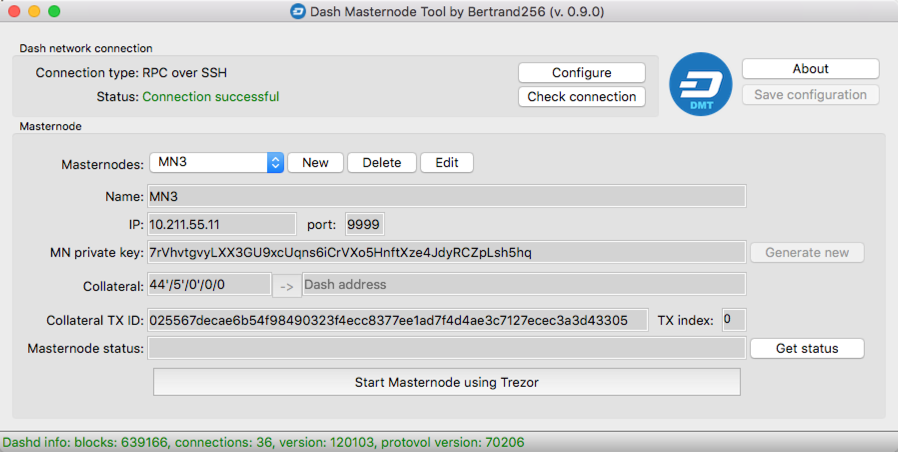

# Dash Masternode Tool (DMT)

Main purpose of the application is to give possibility to start/broadcast Dash masternode with the use of Trezor hardware wallet as a controller of a 1000 Dash collateral. Currently application implements only basic functionality - it doesn't verify if collateral information provided by the user is correct, so it is user's responsibility to carefully check that data. However, that kind of improvements are planned in the future.

## Binaries
Application is written in python, but for your convinience it is compiled into single executable for Windows, Mac (and soon for Linux). To download archive, click release link on the project main page or: https://github.com/Bertrand256/dash-masternode-tool/releases. App's startup-time maybe is not very fast, but it's just the cost of convinience of having all in one exe file - when starting, app has to unpack all needed libraries.

## Main application window

## Steps to configure app
Broadcasting message about a masternode (but also checking of a masternode's status) requires you to have access to a working Dash daemon (dashd) with JSON-RPC enabled. This can be Dash-QT on your local network or Dash daemon working as your masternode - before you broadcast message about your masternode, you have to have its dashd running, so it can help you to broadcast message about itself.

### Enable JSON-RPC of dashd
To enable dashd JSON-RPC, edit file dash.conf located in a subdirectory .dashcore (linux) and configure the following parameters:
  - rpcuser=any_alphanumeric_string_as_a_username
  - rpcpassword=any_alphanumeric_string_as_a_password
  - rpcport=9998
  - rpcallowip=127.0.0.1
  - server=1

Restart Dash daemon after file modification to make the new parameters working.
 
### Configure Dash daemon connection in DMT
In the main window click "Configure" button.
Choose tab "Dashd direct RPC" if your Dash daemon works on your local network or has exposed RPC port on the Internet (not recomended). In this mode dialog's parameters are self explanatory.

If your Dash daemon works on remote server and according to most recomendations, has no RPC port exposed to the Internet, but on the other hand has open SSH port (22), second mode, activated by clicking "Dashd RPC over SSH tunnel", is for you.

Enter values in the "SSH host", "port" and "SSH username" editboxes.
Now, you can click "Read RPC configuration from SSH host" button to automatically read dashd.conf file from your remote server and then extract parameters related to RPC configuration. This option requires that provided username has privileges to read dash.conf file. This step is not required - you can enter that values manually.

Click "Test connection" to check if RPC communication works as expected.

### Create masternode's configuration
In the main window click the button "New" and fill the information:
  - Name: masternode's name within your config
  - IP: Masternode's IP address, used for inbound communication
  - port: Masternode's TCP port number, used for inbound communication
  - MN private key: if you don't have one, you can generate a new random by clicking "Generate new" button. For this process is used a function from a widely respected pybitcointools library of Vitalik Buterin.
  - Collateral: BIP32 path of your collateral, holding 1000 Dash. 
 
Now, click the "->" button on the right side of the "Collateral" edit box. This will read Dash address related to the BIP32 path entered earlier from your Trezor. On this step you should see a dialog asking for a PIN and a password, of course if such were configured on your Trezor.
 
The last information, you must provide is the Collateral transaction hash and index. 

### Broadcasting information about Masternode.
To broadcast information about your Masternode, click the button "Start Masternode using Trezor". This step will cause  dialogs for Trezor PIN/password to show up and finally Trezor will ask you for broadcast-message signature. 

### Comments
This app has been tested on Mac and Windows 7 with Masternode working on Debian 8 (Jessie). There are many other possible  configurations, so it is also possible, that something will not work in your environment. If such thing happens, you can reach me at blogin[at]nullteq.com, so I'll try to help you. 
