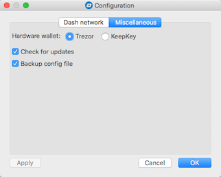
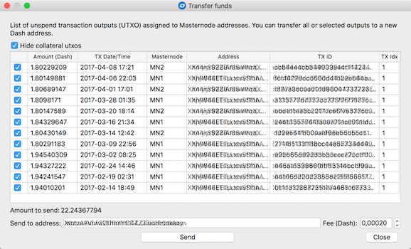
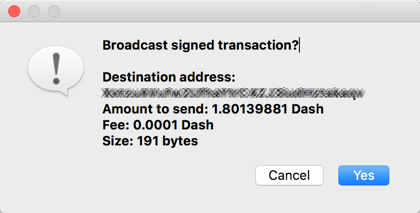
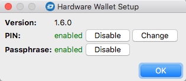

## Dash Masternode Tool (DMT)

### Background (masternodes)
Dash masternodes are full-nodes which are incentivized by paying them a share of the block reward for the work they do for the network. In order to run masternode, apart from setting up a server wich runs the software, you must dedicate 1000 Dash _collateral_, which is _"tied up"_ to your node as long as you want it to be considered a masternode. It's very important, that the private key controlling the funds can (and for security reasons should) be kept outside the masternode server itself. 

A server + installed _Dash daemon_ software form a Dash full-node, but before the rest of the network accepts it as a ligitimate masternode, one more thing must happen: the person controlling the node must prove, that he/she is also in control of the private key of the node's collateral. This is achieved by the requirement of sending the network a special message signed by this private key just after starting the masternode software. This message is referred to as sending _Start masternode_ message. 

This action can be performed using the Dash reference client - Dash Core. As can be expecetd, this requires sending of 1000 Dash to the address controlled by your Dash Core (software) wallet. After the recent increase in the value of Dash and burst of amount of malware distributed on the Internet, you do not have to be paranoid to say that sending that amount of resources to a software wallet is not really secure, regardless of what type of OS you use. For these reasons it is highly recomended to use a **hardware wallet** for this purpose.

### Purpose of the application
The main purpose of the application is to give MNOs (masternode owners) the ability to send _Start masternode_ command with easy to use graphical interface, if MN's collateral is controlled by a hardware wallet, such as Trezor or Keepkey.

##### All features
- Sending _Start masternode_ command if the collateral is controlled by a hardware wallet
- Transfering masternode's earnings in a safe way (without touching callateral's 1000 Dash transaction)
- Signing messages with a hardware wallet
- Voting on proposals (work in progress)

##### Supported hardware wallets
-[x] Trezor
-[x] KeepKey
-[ ] Ledger Nano S (in the future)

Most ot the application features are accessible from tha main program window:  

### Configuration

#### 1. Setting the hardware wallet type
 * Click the `Configure` button.
 * In the configuration dialog that will open, select the `Miscellaneous` tab.
 * Depending on type of your hardware wallet, select the `Trezor` or `Keepkey` option.  
 

#### 2. Dash network configuration

Most of the features of the application involves the exchange of data between the application itself and the Dash network. In short, DMT needs to connect to one of the full-nodes that make up the network, more specifically, the one that handles JSON-RPC requests. For DMT application this node will be playing the role of a gateway to the Dash network. It does not matter which full-node it will be - for the Dash network all are equal and exchange information between themselves.

You can choose one of three possible connection types:
 * [Connection to your local Dash daemon like Dash Core](doc/config-connection-direct.md)
 * [Connection to your remote Dash daemon (like your masternode) through an SSH tunnel](doc/config-connection-ssh.md)
 * [Connection to "public" JSON-RPC proxy](doc/config-connection-direct.md)

#### 3. Configuration of masternode(s)

##### Scenario A - if moving funds from Dash Core software wallet to HW

##### Scenario B - if setting-up a new masternode 

### Create masternode's configuration
In the main window click the button "New" and fill the information:
    
    - Name: masternode's name within your config
    - IP: Masternode's IP address, used for inbound communication
    - port: Masternode's TCP port number, used for inbound communication
    - MN private key: if you don't have one, you can generate a new random by clicking "Generate new" button. For this process is used a function from a widely respected pybitcointools library of Vitalik Buterin.
    - Collateral: BIP32 path of your collateral, holding 1000 Dash. 
 
Now, click the "->" button on the right side of the "Collateral" edit box. This will read Dash address related to the BIP32 path from your Trezor. While this step you should see a dialog asking for a PIN and a password, of course if such were configured on your Trezor.
 
The last information, you must provide is the Collateral transaction hash and index. 

### Broadcasting information about Masternode.
To broadcast information about your Masternode, click the button "Start Masternode using Trezor". This step will cause  dialogs for Trezor PIN/password to show up and finally Trezor will ask you for broadcast-message signature. 

### Download executable version
The application is written in Python, but to run it requires several libraries, which in turn require installation of the C++ compiler. All in all, preparation is not very trivial for non-technical people, especially in Linux OS.

Therefore, in addition to providing source code in Github, I've also released binary versions for all three major operating systems - Mac OS, Windows (32 and 64-bit) and Linux. More specifically, applications is "compiled" and tested under the following OS distributions:
* Windows 7 64-bit
* Mac OSX El Capitan 10.11.6
* Linux Debian Jessie

The latest release can be found under: https://github.com/Bertrand256/dash-masternode-tool/releases/latest

### Transfering funds (version >= 0.9.4)
Beginning with version 0.9.4 DMT you can transfer MN earnings. This works in a bit different way, than with other Dash wallets - DMT gives a user 100% control on which 'unspent transaction outputs' (utxo) he/she whishes to transfer. This eliminates the need of 'Coin control' functionality, implemented in some wallets. 

"Transfer funds" window lists all UTXOs of a currently selected Masternode (mode 1) or all Masternodes in configuration (mode 2). By default, all UTXOs, not used as MN collateral are checked. MN collateral's UTXOs (1000 Dash) are not only unchecked but also hidden, just tu avoid unintentional sending funds tied to a collateral's UTXO and thus breaking MN. You can show those hiddedn entries by unchecking "Hide collateral utxos" option.

To show up the "Transfer funds" window, click the "Tools" button. Then, from popup menu, which expands, choose:
 - "Transfer funds from current Masternode's address" (mode 1)
 - "Transfer funds from all Masternodes addresses" (mode 2) 
  

Select all UTXOs you wish to include in your transaction, verify transaction fee and click the "Send" button. After signing transaction with your hardware wallet, app will ask you if you want do broadcast transaction to Dash network. 

### Signing message with hardware wallet
To sign message with your hardware wallet click the "Tools" button and then select the "Sign message with HW for current Masternode's address" menu item. 
This will show the "Sign message" window:

### Changing hardware wallet's PIN/passphrase configuration
Click the "Tools" button and then "Hardware Wallet PIN/Passphrase configuration" item. This will show up the configuration window:
 

### Comments
This app has been tested on Mac and Windows 7 with Masternode working on Debian 8 (Jessie). There are many other possible  configurations, so it is also possible, that something will not work in your environment. If such thing happens, you can reach me at blogin[at]nullteq.com, so I'll try to help you. 

