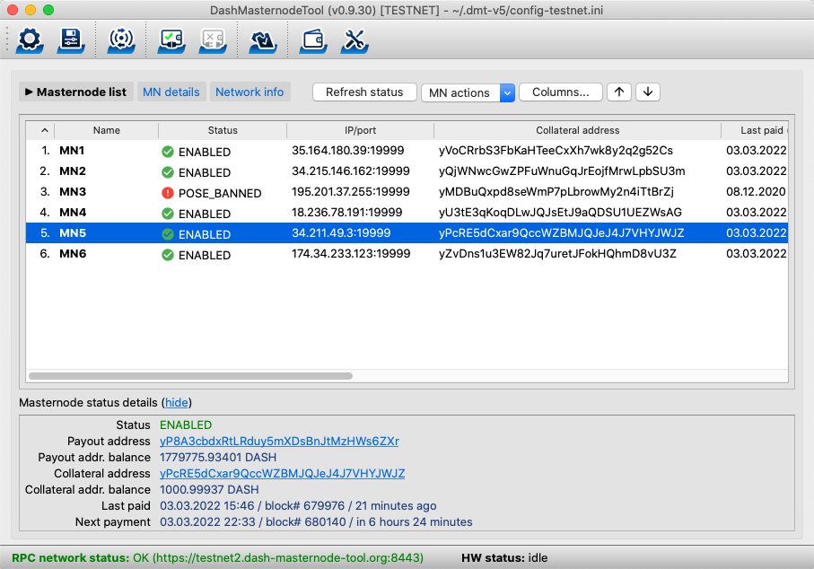

# Dash Masternode Tool (DMT)

## Contents
 * [Masternodes](#masternodes)  
 * [Dash Masternode Tool](#dashmasternodetool)  
   * [Feature list](#features-list)
   * [Supported hardware wallets](#supported-hardware-wallets)
 * [Configuration](#configuration)
   * [Setting up the hardware wallet type](#setting-up-the-hardware-wallet-type)
   * [Connection setup](#connection-setup)
     * [Connection to a local node](doc/config-connection-direct.md)
     * [Connection to a remote node trough an SSH tunnel](doc/config-connection-ssh.md)
     * [Connection to "public" JSON-RPC nodes](doc/config-connection-proxy.md) 
   * [Masternode setup](#masternode-setup)
     * [Scenario A: moving masternode management from Dash Core](doc/config-masternodes-a.md)
     * [Scenario B: configuring a new masternode](doc/config-masternodes-b.md)
   * [Command line parameters](#commandline-parameters)
 * [Features](#features)
   * [Starting a masternode](#starting-masternode)
   * [Transferring masternode earnings](#transferring-of-masternode-earnings)
   * [Signing messages with a hardware wallet](#signing-messages-with-hardware-wallet)
   * [Changing a hardware wallet PIN/passphrase](#changing-hardware-wallets-pinpassphrase)
   * [Browsing and voting on proposals](doc/proposals.md)
 * [Downloads](https://github.com/Bertrand256/dash-masternode-tool/releases/latest)

## Masternodes
Dash masternodes are full nodes which are incentivized by receiving a share of the block reward as payment in return for the tasks they perform for the network, of which the most important include participation in _InstantSend_ and _PrivateSend_ transactions. In order to run a masternode, apart from setting up a server which runs the software, you must dedicate 1000 Dash as _collateral_, which is _"tied up"_ in your node as long as you want it to be considered a masternode by the network. It is worth mentioning that the private key controlling the funds can (and for security reasons, should) be kept separately from the masternode server itself. 

A server with the _Dash daemon_ software installed will operate as a Dash full node, but before the rest of the network accepts it as a legitimate masternode, one more thing must happen: the person controlling the node must prove that they are also in control of the private key to the node's 1000 Dash _collateral_. This is achieved by sending a special message to the network (_start masternode_ message), signed by this private key.

This action can be carried out using the _Dash Core_ reference software client. As can be expected, this requires sending 1000 Dash to an address controlled by the _Dash Core_ wallet. After the recent increase in the value of Dash and a burst in the amount of malware distributed over the Internet, you do not have to be paranoid to conclude that keeping large amounts of funds in a software wallet is not the most secure option. For these reasons, it is highly recommended to use a **hardware wallet** for this purpose.

## Dash Masternode Tool
The main purpose of the application is to give masternode operators (MNOs) the ability to send the _start masternode_ command through an easy to use a graphical user interface if the masternode collateral is controlled by a hardware wallet such as Trezor, KeepKey or Ledger.

#### Feature list
- Sending the _start masternode_ command if the collateral is controlled by a hardware wallet.
- Transferring masternode earnings safely, without touching the 1000 Dash funding transaction.
- Signing messages with a hardware wallet.
- Voting on proposals.

#### Supported hardware wallets
- [x] Trezor
- [x] KeepKey
- [x] Ledger Nano S

Most of the application features are accessible from the main program window:  


## Configuration

### Setting up the hardware wallet type
 * Click the `Configure` button.

 * Select the `Miscellaneous` tab in the configuration dialog that appears.

 * Depending on the type of your hardware wallet, select the `Trezor`, `Keepkey` or `Ledger Nano S` option.      

    

### Connection setup

Most of the application features involve exchanging data between the application itself and the Dash network. To do this, _DMT_ needs to connect to one of the full nodes on the network, specifically one which can handle JSON-RPC requests. This node plays the role of a gateway for *DMT* to the Dash network. It does not matter which full node node provides the service, because all nodes reach consensus by synchronizing information between each other on the Dash network.

Depending on your preferences (and skills) you can choose one of three possible connection types:
 * [Direct connection to a local node](doc/config-connection-direct.md), for example to _Dash Core_ running on your normal computer.
 * [Connection to a remote node through an SSH tunnel](doc/config-connection-ssh.md), if you want to work with a remote Dash daemon (like your masternode) through an SSH tunnel.
 * [Connection to "public" JSON-RPC nodes](doc/config-connection-proxy.md), if you want to use nodes provided by other users.

### Masternode setup
Here we make the following assumptions:
  * You already have a server running the Dash daemon software (_dashd_) that you want to use as a masternode. If you don't, you will need to install and configure one first by following the guide on the [Dash Wiki](https://dashpay.atlassian.net/wiki/display/DOC/Set+Up).
  * We occasionally refer to the _dashd_ configuration file, so it is assumed that *dashd* is running under a Linux operating system (OS), which is the most popular and recommended OS for this purpose.
  * Your server has a public IP address that will be visible on the Internet.
  * You have set up a TCP port on which your _dashd_ listens for incoming connections (usually 9999). 

Further configuration steps depend on whether you already have a masternode controlled by _Dash Core_ which you want to migrate to a hardware wallet managed by *DMT*, or if you are setting up a new masternode. 

[Scenario A - moving masternode management from Dash Core](doc/config-masternodes-a.md)  
[Scenario B - configuration of a new masternode](doc/config-masternodes-b.md)  

### Command line parameters
The application currently supports one command-line parameter: `--config`, which can be used to pass a non-standard path to a configuration file. Example:
```
DashMasternodeTool.exe --config=C:\dmt-configs\config1.ini 
```

## Features
### Starting a masternode
Once you set up the Dash daemon and perform the required _DMT_ configuration, you need to broadcast the `start masternode` message to the Dash network, so the other Dash nodes recognize your daemon as a masternode and add it to the payment queue.

To do this, click the `Start Masternode using Hardware Wallet` button.

### Sequence of actions
This section describes the steps taken by the application while starting the masternode, and possible errors that may occur during the process. 

The steps are as follows:

1. Verification that all the required fields are filled with correct values. These fields are: `IP`, `port`, `MN private key`, `Collateral`, `Collateral TX ID` and `TX index`.  
  An example message in case of errors:  
  

2. Opening a connection to the Dash network and verifying if the Dash daemon to which it is connected is not still waiting for synchronization to complete.  
  Message in case of failure:  
    

3. Verification that the masternode status is not already _ENABLED_ or _PRE_ENABLED_. If it is, the following warning appears:  
    
  If your masternode is running and you decide to send a _start masternode_ message anyway, your masternode's payment queue position will be reset. 

4. Opening a connection to the hardware wallet. Message in case of failure:  
   

5. If the `BIP32 path` value is empty, _DMT_ uses the _collateral address_ to read the BIP32 path from the hardware wallet.

6. Retrieving the Dash address from the hardware wallet for the `BIP32 path` specified in the configuration. If it differs from the collateral address provided in the configuration, the following warning appears:  
     
  The most common reason for this error is mistyping the hardware wallet passphrase. Remember that different passphrases result in different Dash addresses for the same BIP32 path.

7. Verification that the specified transaction ID exists, points to your collateral address, is unspent and is equal to exactly 1000 Dash. Messages in case of failure:  
    
    
  If you decide to continue anyway, you probably won't be able to successfully start your masternode.

8. Verification at the Dash network level that the specified transaction ID is valid. Message in case of failure:
  

9. After completing all pre-verification, the application will ask you whether you want to continue:  
    
  This is the last chance to stop the process.

10. Sending the _start masternode_ message. Success returns the following message:  
    
  In case of failure, the message text may vary, depending on the nature of the problem. Example:  
  


### Transferring masternode earnings
DMT version 0.9.4 and above allows you to transfer your masternode earnings. Unlike other Dash wallets, DMT gives you a 100% control over which _unspent transaction outputs_ (utxo) you want to transfer. This has the same effect as the _Coin control_ functionality implemented in the _Dash Core_ wallet. 

The `Transfer funds` window shows all _UTXOs_ of the currently selected Masternode (mode 1), all Masternodes in current configuration (mode 2) or any address controlled by a hardware wallet (mode 3). All _UTXOs_ not used as collateral are initially selected. All collateral _UTXOs_ (1000 Dash) are initially hidden to avoid unintentionally spending collateral funds and thus breaking MN. You can show these hidden entries by unchecking the `Hide collateral utxos` option.

To show the `Transfer funds` window, click the `Tools` button. Then, from the popup menu choose:
 - `Transfer funds from current Masternode's address` (mode 1)
 - `Transfer funds from all Masternodes addresses` (mode 2)
 - `Transfer funds from any HW address` (mode 3) 

Sending masternode payouts:  


Transferring funds from any address controlled by a hardware wallet:  
 

Select all _UTXOs_ you wish to include in your transaction, verify the transaction fee and click the `Send` button. After signing the transaction with your hardware wallet, the application will ask you for confirmation to broadcast the signed transaction to the Dash network. 


After clicking `Yes`, the application broadcasts the transaction and then shows a message box with a transaction ID as a hyperlink directing to a Dash block explorer:


### Signing messages with a hardware wallet
To sign a message with your hardware wallet, click the `Tools` button and then select the `Sign message with HW for current Masternode's address` menu item. The `Sign message` window appears:


### Changing hardware wallet PIN/passphrase
Click the `Tools` button and select the `Hardware Wallet PIN/Passphrase configuration` item. The following window will appear to guide you through the steps of changing the PIN/passphrase:


### Downloads
This application is written in Python 3, but requires several additional libraries to run. These libraries in turn require the installation of a C++ compiler. All in all, compiling DMT from source is not trivial for non-technical people, especially the steps carried out under Linux (though this will be documented soon).

For this reason, in addition to providing the source code on GitHub, binary versions for all three major operating systems - macOS, Windows (32 and 64-bit) and Linux - are available for download directly. The binaries are compiled and tested under the following OS distributions:
* Windows 7 64-bit
* macOS 10.11.6 El Capitan 
* Linux Debian Jessie

Binary versions of the latest release can be downloaded from: https://github.com/Bertrand256/dash-masternode-tool/releases/latest.


