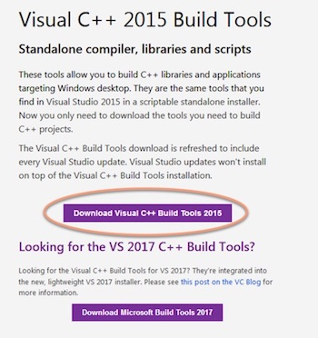

## Building DashMasternodeTool executable on Windows
The following procedure describes the process of building a 64-bit executable on Windows 7 operating system. If you need to compile a 32-bit version or use Windows 10 OS, the procedure will not differ significantly.

We assume that the procedure is carried out on a bare operating system, on which you have not previously installed any program used in the procedure (eg Python). If you have done this however, to avoid any confusion regarding the incompatibility of the software, you should uninstall them first.

### Install *Python*
To run DMT, you need Python version 3.6 or above, so the first step is to download and install the interpreter.
* Within your preferred Web browser open the: http://www.python.org/downloads/release/python-364 url

* Scroll to the *Looking for a specific release?* table and click the link corrensponding to the latest release of the 3.6 version (at the time of writing it was 3.6.4)

  

* From the _Files_ section click the _Windows x86-64 executable installer_ link  

  

* Start the installer

* Check the *Add Python 3.6 to PATH* option and click the *Customize installation* link:

  

* On the *Optional features* step leave the options in their default state and click *Next*:

  

* On the *Advanced Options* step check the *Install for all users* option. I also suggest to simpify the installation path:

  

* After clicking the *Install* button and waiting several seconds, the installation process completes.

### Install *Git*

* Open the https://git-scm.com/download/win URL in your Web browser. If the download process doesn't start automatically, click the link for the 32 or 64 installer:

  

* Execute the installer and carry on the installation leaving all settings in the default state.

### Install *7-zip*

At the end of the build process of DMT, the build script compresses resulting exe file created during the build process. For this it uses an open source *7-zip*, which we have to install according to the steps below. 

* Open the http://www.7-zip.org/ page in your Web browser

* Download the 64-bit installer

* Install the application

* Add the installation path (default *C:\Program Files\7-Zip*) to your Windows system PATH evironment variable:  

  
  After this, you should be able to execute 7z.exe from the Windows commandline.


### Install *Visual C++ 2015 Build Tools*

* Go to the http://landinghub.visualstudio.com/visual-cpp-build-tools page in your Web browser

* Download the installer:

  

* Execute the installer, leave the *Default* option checked and click the *Install* button:

  

* After a few minutes the installation completes

### Install the required Python libraries/addons

Open you Windows commandline tool (*cmd.exe*) - you will use it to execute the commands in the following steps

* Install virtualenv:
  ```
  pip install virtualenv
  ```

* Create a directory dedicated to hold your Python virtual environment: *c:\projects\virtualenvs*:
  ```
  mkdir c:\projects
  mkdir c:\projects\virtualenvs
  c:
  cd c:\projects\virtualenvs
  ```

* Create a Python virtual environment dedicated to DMT:

  ```
  virtualenv -p c:\Python36-64\python.exe dmt-64
  ```

  *dmt-64* is a directory name (inside the *c:\projects\virtualenvs* path) that will be created as a result

* Activate the virtual environment:

  ```
  c:\projects\virtualenvs\dmt-64\Scripts\activate.bat
  ```

* Download the DashMasternodeTool source code from the Github repository:

  ```
  cd c:\projects
  git clone https://github.com/Bertrand256/dash-masternode-tool
  ```

* Install the project requirements:

  ```
  cd dash-masternode-tool
  pip install -r requirements.txt
  ```
  
* Build the DashMasternodeTool executable:

  ```
  pyinstaller --distpath=..\dist\win64 --workpath=..\build\win64 dash_masternode_tool.spec
  ```


As a result of a successful build, a compressed Windows exe is created in the ***c:\projects\dist\all*** directory.  
An uncompressed executable (*DashMasernodeTool.exe*) can be found in the ***c:\projects\dist\win64*** directory. 