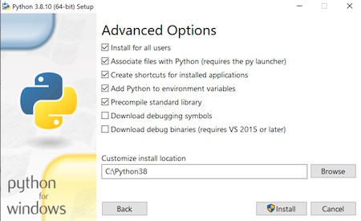

## Building the Dash Masternode Tool executable on Windows
The following procedure describes the process of building a 64-bit executable file under Windows 7. The procedure to compile for a 32-bit version or using Windows 10 does not differ significantly.

We assume that the procedure is carried out on a clean installation of the operating system, on which you have not previously installed any program used in the procedure (e.g. Python). To avoid any confusion arising from version incompatibilities, any previously installed software should be uninstalled first.

### Install *Python*
Python version 3.6 or above is required to build DMT. Download and install Python first as follows:
* Open your preferred web browser and go to https://www.python.org/downloads/

* Scroll to the *Looking for a specific release?* section and click the link corresponding to the latest release of the 3.6 version (3.6.4 at the time of writing):

  

* From the _Files_ section, click the _Windows x86-64 executable installer_ link:

  

* Run the installer

* Check the *Add Python 3.6 to PATH* option and select *Customize installation* link:

  

* In the *Optional features* step, leave the options in their default state and click *Next*:

  

* In the *Advanced Options* step, check the *Install for all users* option. It is also recommended to install to a simple installation path such as *C:\Python36-64* for example:

  

* Click the *Install* button. The installation process will complete after a few seconds.

### Install *Git*

* Open your preferred web browser and go to https://git-scm.com/download/win 

* The download process should start automatically. If it doesn't, click the link to download the 64-bit installer:

  

* Run the installer using the default settings in each step

### Install *7-zip*

The final step of the DMT build process compresses the executable file created during the build process. The open source software *7-zip* is used for this, so it must be installed according to the following steps.

* Open your preferred web browser and go to http://www.7-zip.org

* Download the 64-bit installer

* Install the application using the default settings in each step

* Add the installation path (default *C:\Program Files\7-Zip*) to your Windows PATH environment variable under *Start -> Settings -> Control Panel -> System -> Advanced -> Environment Variables -> System Variables -> Path -> Edit -> New* :  

  
  After this, it should be possible to run *7z.exe* from the Windows command prompt.


### Install *Visual C++ 2015 Build Tools*

* Download the installer from http://go.microsoft.com/fwlink/?LinkId=691126:


* Run the installer with the *Default* option selected and click the *Install* button:

  

* The installation process will complete after a few minutes.

### Install the required Python libraries/addons

Open the Windows command prompt (*cmd.exe*)  and run the following commands:

* Install *virtualenv*:
  ```
  pip install virtualenv
  ```

* Create a directory to hold your Python virtual environments, such as *C:\projects\virtualenvs*:
  ```
  mkdir c:\projects
  mkdir c:\projects\virtualenvs
  cd c:\projects\virtualenvs
  ```

* Create a Python virtual environment for DMT:

  ```
  virtualenv -p c:\Python36-64\python.exe dmt-64
  ```

  The *dmt-64* directory will be created under *C:\projects\virtualenvs*

* Activate the new virtual environment:

  ```
  c:\projects\virtualenvs\dmt-64\Scripts\activate.bat
  ```

* Download the DMT source from GitHub:

  ```
  cd c:\projects
  git clone https://github.com/Bertrand256/dash-masternode-tool
  ```

* Install the DMT Python requirements:

  ```
  cd dash-masternode-tool
  pip install -r requirements.txt
  ```
  
* Build the DMT executable:

  ```
  pyinstaller --distpath=..\dist\win64 --workpath=..\build\win64 dash_masternode_tool.spec
  ```


Once the build has completed successfully, a compressed Windows executable file will be created in the ***C:\projects\dist\all*** directory. An uncompressed executable file (*DashMasernodeTool.exe*) can be found in the ***C:\projects\dist\win64*** directory.