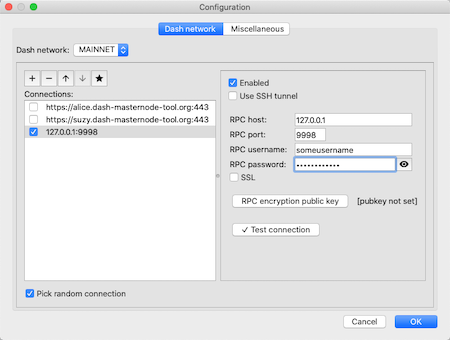

## Direct JSON RPC connection
In this scenario you are going to use your own _Dash daemon_ configured to serve JSON-RPC requests on your local network or on any network you have direct (non filtered) access to. The most convinient way to achieve this is to run a daemon on the same computer on which you run the DMT application. 

### 1. Install Dash Core software wallet
As a _Dash daemon_ you are going to use the Dash official client - Dash Core. If you haven't installed this program before, do it now. Installer matching your operating system can be downloaded from the following page: https://www.dash.org/wallets.

### 2 Enable JSON-RPC and indexing in the Dash Core
####  2.1 Set the required parameters in the `dash.conf` file
Default Dash Core configuration doesn't have any of the required settings, so it will be necessary to make some changes in the `dash.conf` file. Location of this file varies depending on the operating system you are using, and may be changed during installation, so I will not specify any paths due to possible confusion. Instead, I suggest clicking the `Tools->Open Wallet Configuration File` menu item of the Dash Core application. After that `dash.conf` file will be open in default text editor. 

Copy and paste into the file the following parameters/values, changing the `rpcuser` and `rpcpassword` values to your own:
```ini
rpcuser=any_alphanumeric_string_as_a_username
rpcpassword=any_alphanumeric_string_as_a_password
rpcport=9998
rpcallowip=127.0.0.1
server=1
addressindex=1
spentindex=1
timestampindex=1
txindex=1
```
  
#### 2.1 Restart the Dash Core application
#### 2.2 Rebuild index
Setting parameters related to indexing and even restarting the application is not enaugh for the Dash Core internal database to be indexed - it is necessary to force the operation.

For this:
 * Click the `Toools->Wallet Repair` menu item.
 * In the _Tools_ dialog that will open click the `Rebuild index` button.  
 

 
### 3. Configure the connection in DMT
 * In the main application window click the `Configure` button. 
 * Choose the `Dashd network` tab.
 * Click the `+` (plus) button on the left side of the dialog.
 * Fill in the values:
   * `RPC host` to 127.0.0.1
   * `port` to 9998
   * `RPC username` to a value you've entered for `rpcuser` parameter in the `dash.conf` file.
   * `RPC password` to a value you've entered for `rpcpassword` parameter in the `dash.conf` file.
 * Make sure, that `Use SSH tunnel` and `SSL` checkboxes are unchecked. Also, if you decide to use only this connection, deactivate all other connections by unchecking their `Enabled` checkbox.
 
 * Click the `Test connection` button. The successful connection test ends with the following message:
 
 


