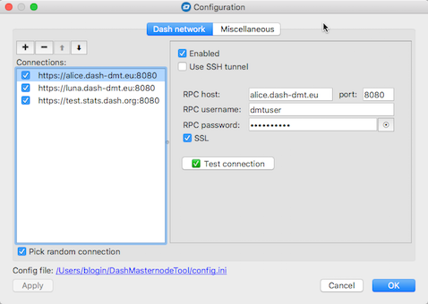
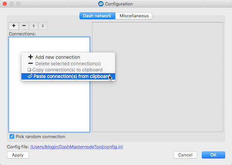

# Connection to "public" nodes

This solution is designed for non-technical users who may have difficulty configuring their own JSON-RPC node, or for those who do not want to waste their time repeating what others have done before and have made publicly available :-)

From the user's point of view, the solution is based on several JSON-RPC nodes made available by the Dash community to the users of the *Dash Masternode Tool* and *dashmnb* apps. At the time of writing, one of the nodes (actually three, accessed under one shared IP address) was managed by @chaeplin, a very well-known Dash Core developer, and the other three by myself (@Bertrand256).

## Technical information

These nodes are based on the following components:
 * Dash daemon (*dashd*) processing JSON-RPC requests
 * *Nginx* web server, as a frontend serving SSL requests sent by the applications
 * A Lua script, as a broker between *nginx* and *dashd*

Configuration is based on ethereum-nginx-proxy, adapted to Dash requirements by @chaeplin: https://github.com/chaeplin/dash-ticker/tree/master/web/nginx

## Configuration

When version 0.9.5 or higher of the DMT application is run the first time, "public" connections will automatically be added to the configuration. Open DMT and click the `Configure` button. In the `Configuration` dialog you should see the following three connections:
 * https://alice.dash-masternode-tool.org:443
 * https://luna.dash-masternode-tool.org:443
 * https://suzy.dash-masternode-tool.org:443
 * https://test.stats.dash.org:8080



If you see connections and all three are checked (enabled) you don't need to do anything. If you see connections but they are not enabled, you just need to enable them. I also suggest deactivating all other connections, since these may be connections from an old configuration.

If any of the listed "predefined" nodes are missing or are incomplete, follow these steps:
 * Select all the text from the block below and copy to the clipboard (do not miss the square brackets at the beginning and the end of the text), for Dash MAINNET:
```
[
    {
        "use_ssh_tunnel": false,
        "host": "alice.dash-masternode-tool.org",
        "port": "443",
        "username": "dmtuser",
        "password": "6741414141414261316250626f7137584e5950467975446e4670324e654f4f2d55706c37456634344c416d3461446d3035706436764d625875723137424b526a73665630444471506e795a475a446d696b2d657742526e4268597a634f364a624f673d3d",
        "use_ssl": true
    },
    {
        "use_ssh_tunnel": false,
        "host": "luna.dash-masternode-tool.org",
        "port": "443",
        "username": "dmtuser",
        "password": "6741414141414261316250624e5146722d50665846656f4e524d4d2d304247466d654e4a496f5f4f352d364b74514a36364a695955387a63524f456663624a347953567152527570625830537a583234757135316c2d775444555a5a6865786b44413d3d",
        "use_ssl": true
    },
    {
        "use_ssh_tunnel": false,
        "host": "suzy.dash-masternode-tool.org",
        "port": "443",
        "username": "dmtuser",
        "password": "674141414141426131625062763362616a4b6566376b5070474c3447547061314731562d4854314e69784a4c74382d5870744b674a4b64454d7765306142495756734f52463077647651727247335878536a7050376253596c664469783167386f413d3d",
        "use_ssl": true
    },
    {
        "use_ssh_tunnel": false,
        "host": "test.stats.dash.org",
        "port": "8080",
        "username": "dashmnb",
        "password": "674141414141426131625062376564486d456f47374658464542763742484f6e6f3453686350587837654d514c51484a4a46385a4c415a374a325574445637454d3356793979337444525f765f524e7a56747579344d73714d426d6c372d6d4c72773d3d",
        "use_ssl": true
    }
]
```
and for Dash TESTNET:
```
[
    {
        "use_ssh_tunnel": false,
        "host": "testnet1.dash-masternode-tool.org",
        "port": "8443",
        "username": "dmtuser",
        "password": "6741414141414261316251666e4e6f59574d587675563559343661524c672d4253665433734a74324a6c52304f316677586a67507071326a75515072734d667058706c525f304f6b4861565f5974414469325f6d78584745393677592d6a4b6f56773d3d",
        "use_ssl": true
    },
    {
        "use_ssh_tunnel": false,
        "host": "testnet2.dash-masternode-tool.org",
        "port": "8443",
        "username": "dmtuser",
        "password": "674141414141426131625166386e72744b612d564c4f726b306461717630796b335875586c336b626849665a587964697343574b314f32325a513378475876704c65324b35746435367659366b68416f4b6d395577437477414979716d6f636841513d3d",
        "use_ssl": true
    }
]
```
 * Right-click on the `Connections` box.
 * From the popup menu choose the `Paste connection(s) from cliboard` action:
    
 * Click `Yes` to the question whether you want to import connections.

All three connections should then be added to the configuration.

## Security

To perform its job, the application must send some data to the JSON-RPC node that may be perceived as sensitive. Specifically, these are the client's IP address and the JSON-RPC commands themselves, with their respective arguments.

For example, the action initiated by the `Get status` button sends the following data to the node:
```python
{"version": "1.1", "id": 2, "params": ["full", "19e7eba493a026f205078469566e4df6a5a4b1428965574b55bec2412ddc9c48-0"], "method": "masternodelist"}
```

To maximize user anonymity, all three published nodes have disabled logging of any information related to JSON-RPC commands. The logging configuration is exactly the same as the example scripts provided by @chaeplin here: [https://github.com/chaeplin/dash-ticker/tree/master/web/nginx](https://github.com/chaeplin/dash-ticker/tree/master/web/nginx).

Despite this, if you would prefer not to risk sharing this information, it is suggested to disable the configuration options for the "public" nodes and choose a different type of connection:

- [Connection to a local Dash daemon](config-connection-direct.md)
- [Connection to a remote Dash daemon through an SSH tunnel](config-connection-ssh.md)
