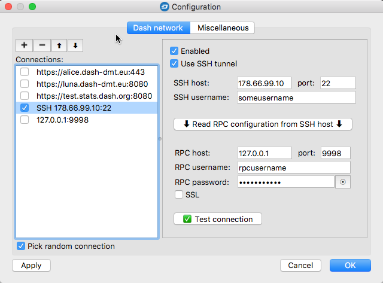

## Connection to remote Dash daemon through on SSH tunnel

### SSH tunnels
If you - as probably most masternode owners - have your masternode runnung under VPS service and you have access to it via SSH, then using it as a JSON-RPC gateway will probably be the best option for you. 

For security reasons, the TCP port used for JSON-RPC communication (9998 by dafault) should be blocked on Dash full-nodes. For this reason, you will not be able to connect to it directly over the Internet. However, if you have SSH access to this server, you can create a secure channel that connects the local machine to the remote JSON-RPC service so that the DMT application feels like the remote service was working locally. 

The communication is carried out as follows:
 * an SSH session with a remote server (Dash daemon) is created using its public IP and SSH port 
 * out of the pool of unused ports on your computer, a random is selected to play the role of the local channel's endpoint
 * within established SSH session a secure channel is created that connects local endpoint with the port on which the JSON-RPC service is listening on the remote server (127.0.0.1:9998)
 * DMT connects to the local endpoint and performs JSON-RPC requests as if the _Dash daemon_ was working locally
 

```
 Local computer ━━━━━━━━━━━━━━━━➜ SSH session ━━━━━━━━━━━━━━━━➜ remote_server:22
           ┃- connecting to 127.0.0.1:random local port           ┃ - listenning on 127.0.0.1:9998 
 DMT app ━━┛                                                      ┗━━━ Dash daemon JSON-RPC
```

### Configuration

#### 1. Enable JSON-RPC and "indexing" in the Dash daemon configuration
The procedure is similar to the RPC/indexing [setup](config-connection-direct.md#2-enable-json-rpc-and-indexing-in-the-dash-core) in Dash Core application.
 * log-in to the server running _Dash daemon (dashd)_ with a SSH terminal
 * cd do the _dashd's_ configuration directory: `cd ~/.dashcore`
 * open the `dash.conf` file with your preferred text editor
 * enter the configuration parameters that have been listed [here](config-connection-direct.md#21-set-the-required-parameters-in-the-dashconf-file)
 * stop the _Dash daemon_: `./dash-cli stop` 
 * start the _Dash daemon_ with reindex option: `./dashd -reindex`
 
### 2. Configure connection in DMT
 * In the main application window click the `Configure` button. 
 * Choose the `Dashd network` tab.
 * Click the `+` (plus) button on the left side of the dialog.
 * Check the box `Use SSH tunnel`.
 * Check the box `Enabled`.
 * Fill in the values:
   * `SSH host`: IP addres (hostname) of your remote server
   * `port`: SSH listening port number of the server
   * `SSH username`: username you are using to establish a connection
   * `RPC host`: IP address of the network interface where _dashd_ listens for JSON-RPC calls (127.0.0.1 by default)
   * `port`: TCP port number on which _dashd_ listens for JSON-RPC calls
   * `RPC username`: a value you've entered for `rpcuser` parameter in the `dash.conf` file
   * `RPC password`: a value you've entered for `rpcpassword` parameter in the `dash.conf` file   
 
 Instead of entering parameters related to the RPC configuration, you can click the `Read RPC configuration from SSH host`. In this case the applications will try to read the values from the remote `dash.conf` file.  
 * Make sure, that `SSL` checkbox is unchecked. Also, if you decide to use only this connection, deactivate all other connections by unchecking their `Enabled` checkbox.  
 
 * Click the `Test connection` button. The successful connection test ends with the following message:  
 
 
