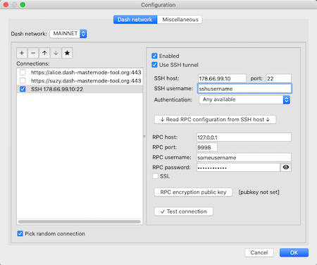

# Connection through an SSH tunnel

## SSH tunnels

If you - like most masternode owners - have your masternode running on a VPS with SSH access capabilities, then using it as an RPC gateway will probably be a good option to consider.

For security reasons, the TCP port number used for RPC communication (`9998` by default) should be blocked on the firewall of the VPS instance. For this reason, you will not be able to connect to your Dash daemon and use the RPC service directly over the Internet. However, using certain features of the SSH protocol, you can create a secure tunnel connecting your workstation running DMT to a remote RPC service as if that remote service were available on your workstation.

The communication is set up as follows:
 * an SSH session with the remote server is established over its public IP address and SSH TCP port
 * a random port is selected from the pool of unused ports on your computer to play the role of the local channel's endpoint
 * within the established SSH session, a secure channel is created that connects the local endpoint with the listening RPC service port on the remote server (`127.0.0.1:9998`)
 * DMT connects to the local endpoint and performs RPC requests as if the Dash daemon was working locally

```
 Local computer ━━━━━━━━━━━━━━━━> SSH session ━━━━━━━━━━━━━━━━> remote_server:22
           ┃- connecting to 127.0.0.1:random local port           ┃ - listenning on 127.0.0.1:9998
 DMT app ━━┛                                                      ┗━━━ Dash daemon JSON-RPC
```

## Configuration

### RPC node configuration (enabling RPC and "indexing")

The procedure is similar to the RPC/indexing [procedure](config-connection-direct.md#enable-rpc-and-indexing-in-dash-core) for a local RPC node scenario.
 * Log in to the VPS/server running the Dash daemon (*dashd*) with an SSH terminal.
 * Change to the *dashd* configuration directory: `cd ~/.dashcore`
 * Open the `dash.conf` file with your preferred text editor: `nano dash.conf`
 * Enter the configuration parameters listed [here](config-connection-direct.md#set-the-required-parameters-in-the-dashconf-file).
 * Stop the *dashd* process: `./dash-cli stop`
 * Start *dashd* with the `-reindex` parameter: `./dashd -reindex`

Keep in mind that the last step can take several hours to complete. If running on a live masternode, it may be best to wait until immediately after a payment was received to carry out the reindexing.

### DMT application configuration  (network connection)

 * In DMT click the `Settings` button.
 * Select the `Dash network` tab.
 * Click the `+` (plus) button on the left side of the dialog.
 * Check the `Use SSH tunnel` box.
 * Check the `Enabled` box.
 * Enter the following values:
   * `SSH host`: IP address (hostname) of your remote VPS/server.
   * `port`: SSH listening port number of the server (usually `22`).
   * `SSH username`: username you are using to establish a connection.
   * `Authentication`: select your preferred SSH authentication method.
   * `RPC host`: IP address of the network interface where *dashd* listens for JSON-RPC calls (`127.0.0.1` by default).
   * `port`: TCP port number on which *dashd* listens for JSON-RPC calls (`9998` by default).
   * `RPC username`: enter the value you specified for the `rpcuser` parameter in the `dash.conf` file.
   * `RPC password`: enter the value you specified for the `rpcpassword` parameter in the `dash.conf` file.

    Instead of entering parameters related to the RPC configuration, you can click `Read RPC configuration from SSH host` to try to read the values directly from the remote `dash.conf` file. However, for this method to work, in the `SSH username` field, you have to enter the Unix username under which the Dash daemon is running.

 * Make sure the `SSL` checkbox remains unchecked. Also, if you decide to use only this connection, deactivate all other connections by unchecking the corresponding `Enabled` checkboxes.  
   
 * Click the `Test connection` button. If successful, DMT will return the following message:  
   
