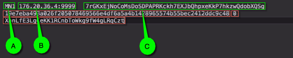
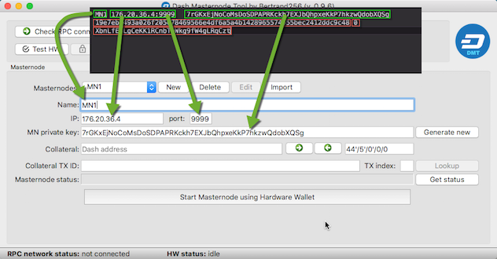
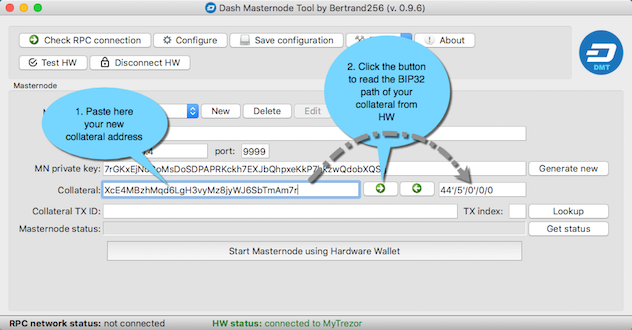
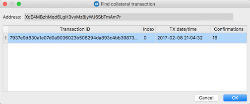
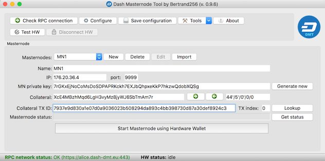

# Moving masternode management from Dash Core application

This scenario is intended for those who already have a running masternode controlled by the *Dash Core* software wallet, and want to shift masternode management to take advantage of the higher level of security offered by hardware wallets.

In the old configuration, *Dash Core* controls the private key of the 1000 Dash collateral, and is used to send the `start masternode` command. By contrast, in the target configuration, the 1000 Dash collateral is controlled by a hardware wallet (such as Trezor) and the `start masternode` command is invoked by the *Dash Masternode Tool* application.

The procedure described below boils down to sending 1000 Dash funds from your *Dash Core* wallet to a new address controlled by a hardware wallet, and then configuring the masternode in *DMT*. You will not be changing any of the *dashd* configuration parameters, so you will not need to restart it at the end of the sequence. However, you must be aware that sending a `start masternode` message will reset the position of your masternode in the payment queue. For this reason, it is best to carry out this change in configuration immediately after receiving your last payment.

## Sending 1000 Dash to the hardware wallet address

Each model of hardware wallet offers its own native client application to perform transactions. The steps described below do not cover all of them, but instead use Trezor and its native web application as an example. The steps are similar for other supported hardware wallets.

### Step 1

Open the Trezor native wallet at https://wallet.trezor.io in the Chrome browser and enter your PIN/passphrase if enabled (it is highly recommended to enable both when setting up your Trezor).

### Step 2

Use the first **empty** account and dedicate it solely to operating your masternode. If you already have an account with regular transactions, create a new account by clicking `Add account` first and use this for all masternode operations. If you don't separate your daily accounts from your masternode account, then you may have problems keeping your 1000 Dash transaction intact, which will end up with your masternode being repeatedly moved to the back of the payment queue. The reason behind this is that the native Trezor wallet does not have a *coin control* feature to block spending certain transactions for day-to-day transactions. The result is that you may accidentally spend your masternode collateral while making a normal transaction.  
    
The first fresh address in the new account is your new masternode **collateral address**. Try to receive and send a small transaction using this address to verify everything works as expected. You should also try to recover your Trezor and reestablish access to the account and address if you have not already done so.

### Step 3

Open the *Dash Core* wallet and send exactly 1000 Dash to your **collateral address**.

## Moving masternode parameters from Dash Core to Dash Masternode Tool

### Step 4

In the *Dash Core* wallet, click the `Tools -> Open Masternode Configuration File` menu item. This will open your current `masternode.conf` file in your default text editor. This file contains your existing masternode configuration, parts of which will be used in your target configuration. Each masternode entry occupies one line as shown in the screenshot below (the line is wrapped):  
  

    Each line consists of five to six sections (in the screenshot surrounded by green/red rectangles):
    A. Masternode name
    B. Masternode IP:port
    C. Masternode private key
    D. 1000 Dash transaction id
    E. 1000 Dash transaction index
    F. Masternode collateral address (not mandatory)
Only the first three - labeled as *A*, *B* and *C* - will be reused in the target configuration.

### Step 5

Run *Dash Masternode Tool* and click the `New` button to enter *edit* mode. If you don't have any masternode entries in the current configuration, *edit* mode is activated automatically.

### Step 6

Copy the `Name` (you can change it - it's just a label), the `IP:port` and the `MN private key` to the corresponding fields in *DMT*.  
  

## Entering information on the collateral

### Step 7

Enter the new **collateral address** you obtained in [Step 2](#step-2) in the `Collateral` edit box, then click the right-facing arrow button to the right to automatically retrieve the BIP32 path of the **collateral address**.  
  

### Step 8

Click the `Lookup` button to automatically fill in the `Collateral TX ID` and `TX index` of the 1000 Dash transaction you sent in [Step 3](#step-3). Assuming that the transaction has been processed without any problems, exactly one transaction should appear in the dialog that appears:  
    
Select the transaction and click `OK`.

### Step 9

The `Collateral TX ID` and `TX index` fields should now be filled with the relevant data:  
    
Click the `Save configuration` button at the top.

## Next steps

Before you continue with the last step of the whole configuration (sending the `start masternode` message), make sure that the number of confirmations for the collateral transaction is greater than or equal to 15 (this can be verified in the `Lookup` dialog). If less than 15 confirmations exist, you will not be able to start your masternode successfully. Once this final requirement has been met, you can finally perform the [start masternode](../README.md#starting-a-masternode) operation.
