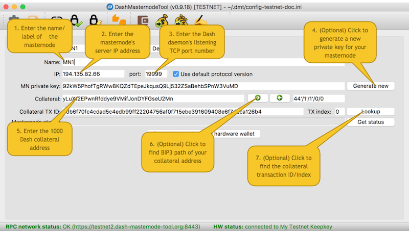
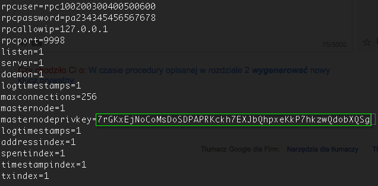

# Configuration procedure for a new masternode

This scenario is intended for those who are configuring their masternode from a clean start (or are not transferring the existing configuration).

Before describing the individual steps, the following prerequisites apply:
  * You have a server with a static public IP address, on which you have installed the *Dash daemon* (*dashd*) software.
  * The server is running a Linux operating system. While other operating systems may work, this guide will assume you are following best practices and using the most popular and supported system available.
  * You have access to the server over SSH.
  * *dashd* has been installed in the home directory of the user which you use to log in to the server.

## Sending 1000 Dash to the address controlled by your hardware wallet

### Step 1

The procedure to send 1000 Dash to a hardware wallet is described [here](config-masternodes-a.md#sending-1000-dash-to-the-hardware-wallet-address).

## Filling in the masternode configuration fields

### Step 2

Run *Dash Masternode Tool* and click the `New` button to enter *edit* mode. If you don't have any masternode entries in the current configuration, *edit* mode is activated automatically.

### Step 3

Fill in the fields:
  * `Name`: name/label of your masternode (can be any alphanumeric string).
  * `IP`: the IP address of the *dashd* server.
  * `port`: the TCP port number on which *dashd* is listening for incoming connections. You should use the value of the `rpcport` parameter from the `dash.conf` file. The default port value is `9999`.

### Step 4

Click the `Generate new` button on the right side of the `MN private key` field to generate a new masternode *private key*.

  > Masternode **private keys**. Some users think that the masternode private key is somehow associated with the private key of the 1000 Dash collateral, but in fact, they have no relationship. The masternode private key is generated independently and is only used in the process of signing the `start masternode` message and voting on proposals, and as such it is not particularly dangerous if it falls into the wrong hands. For this reason, the application includes a feature to automatically generate masternode private keys by simply clicking a button, thus avoiding a requirement to use *Dash Core* for this purpose. From a technical point of view, a masternode private key is a normal private key in the *Dash WIF uncompressed* format.

### Step 5

Enter information related to the collateral as described [here](config-masternodes-a.md#entering-information-on-the-collateral).  


## Changing the configuration of your Dash daemon

As part of the procedure described above, you generated a new masternode private key, which must now be transferred to your *Dash daemon* configuration file on the remote server.

### Step 6

Log in to the server running *dashd* using your preferred SSH terminal client ([PuTTY](https://www.chiark.greenend.org.uk/~sgtatham/putty/latest.html) on Windows, for example), and then:

  * Open the `~/.dashcore/dash.conf` file with your preferred Linux text editor, for example: `nano ~/.dashcore/dash.conf`

  * Set the `masternodeprivkey` parameter to match the masternode private key you generated in [Step 5](#step-5) . This key is the mechanism by which a link is established between the wallet holding the collateral and sending the start command, and the target *dashd* instance which should operate as a masternode.  
      

  * Save the file and exit the editor.

  * Restart *dashd*:
  ```bash
   $ cd ~
   $ ./dash-cli stop
   $ ./dashd
  ```

## Next steps

Before you continue with the last step of the whole configuration (sending the `start masternode` message), make sure that the number of confirmations for the collateral transaction is greater than or equal to 15 (this can be verified in the `Lookup` dialog). If less than 15 confirmations exist, you will not be able to start your masternode successfully. Once this final requirement has been met, you can finally perform the [start masternode](../README.md#starting-a-masternode) operation.
