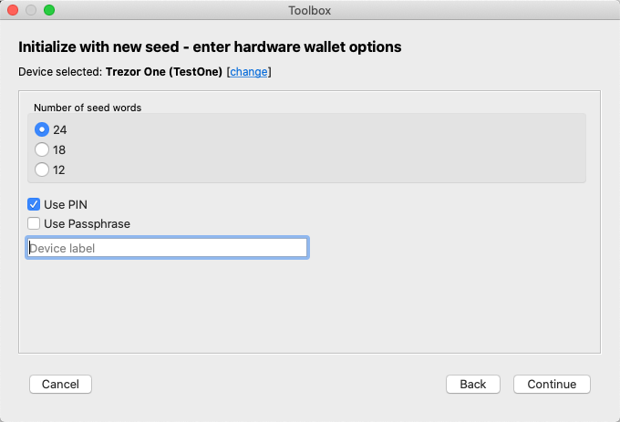
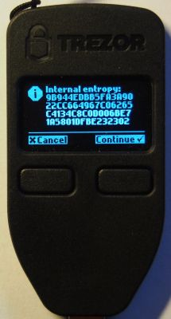
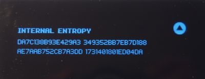
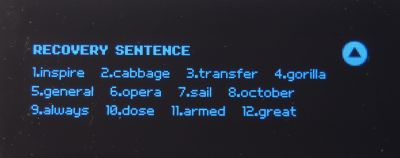
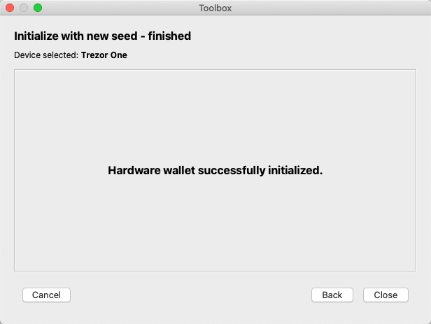

#Hardware wallet initialization with newly generated seed
This functionality initiates the hardware wallet initialization process with the newly generated word set. The process is performed on the device itself, so it is completely safe.

Available for Trezor and Keepkey devices. On Ledger Nano devices, this feature works independently of any external applications - it can be run from the device itself.

###Step 1: Start the hardware wallet initialization wizard
Do this by clicking the *Tools->Toolbox* menu item or the *Toolbox* button on the main window toolbar, then click *Initialize hardware wallet with newly generated seed*.  

###Step 2: Set the initial options  
Select the number of words the generated seed will consist of and whether to enable PIN and password options. The latter two options can be changed later from the [HW settings](other-features.md#changing-the-hardware-wallets-settings) dialog.

### Step 3: Confirm the generated entropy
At this step you will be asked if you accept the internal entropy that was generated in the random number generator. Most people don't know what this means (and don't need to), so basically you should accept with the physical button on the device.

> **Note**. If your device is initialized, you will be asked if you agree to wipe it first.

### Step 4: Confirm and write down the words
The device will show consecutive words of the generated seed (the KeepKey device, by virtue of having a larger screen, displays several words simultaneously). These words should be written down and kept safe. After presenting the complete set of words, the device will show them all again to make sure all words were noted down correctly. 

  

With the completion of the procedure, a summary page will be displayed:
