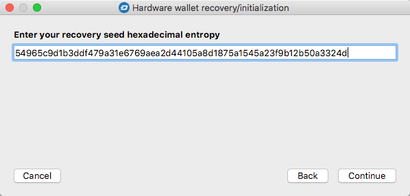
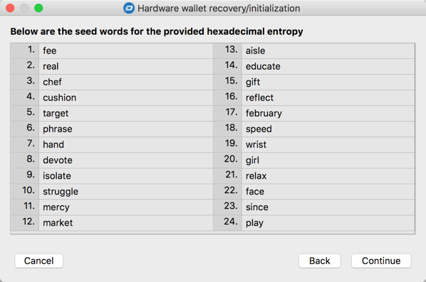

# Hardware wallet recovery based on entropy
Note: for security reasons this procedure should only ever be performed on offline systems.

This option can be useful for people storing recovery seeds in the form of entropy (a number between 12 and 32 bytes) or for people who don’t trust the random number generators used in hardware wallets to generate a new set of words. Such users may prefer to use extremely reliable sources of random data, such as a multiple coin toss. In these situations, for entropy corresponding to the 24 words of the recovery seed, we perform 256 coin tosses and treat each result as a binary "0" or "1". We then convert the binary string to hexadecimal, which is entered according to the description below.

#### Step 1: Select the type of hardware wallet in use in the first step of the wizard

#### Step 2: Select the `Recover hardware wallet from hexadecimal entropy` option 

#### Step 3: Enter the entropy as a hexadecimal string – 16, 24 or 32 bytes long
The length of entropy will influence the number of recovery seed words to be reproduced.

#### Step 4: Check the words 
A static list of words corresponding to the entered entropy is displayed in the next step, allowing you to create a "paper" backup if necessary.  

#### Step 5: Define additional hardware wallet options
This step is described [here](hw-initr-conv-mode.md#step-5-define-hardware-wallet-configuration-options).

#### Step 6: Accept the security prompt
This step is described [here.](hw-initr-conv-mode.md#step-6-accept-the-security-prompt)

