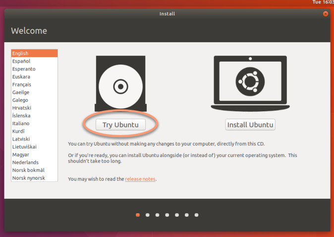
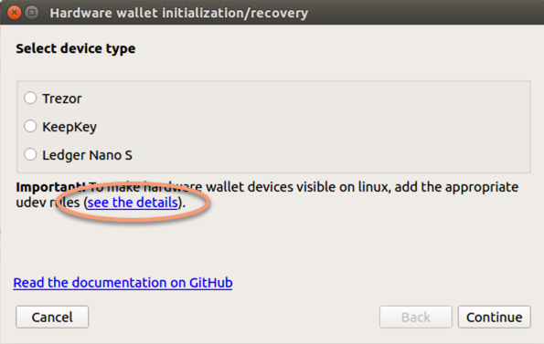
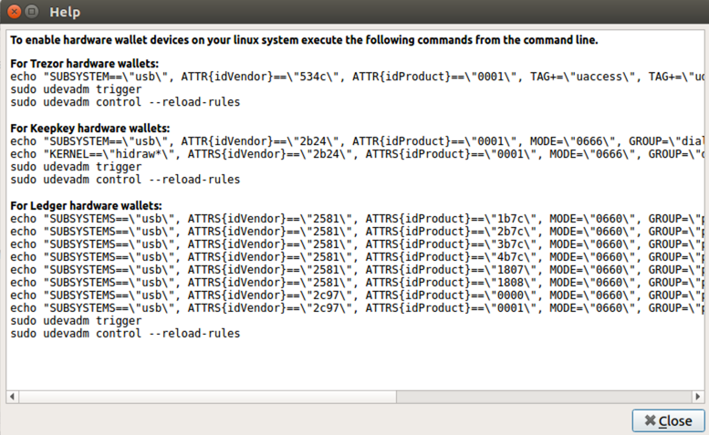
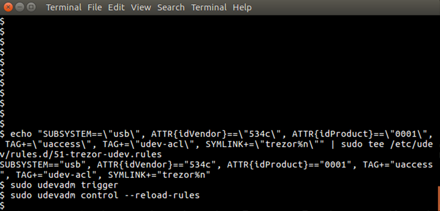

## Running DMT on an offline Linux system
Some of the scenarios presented above, for their security require running DMT on an offline computer. For this purpose, the distribution of Ubuntu Linux is perfectly suitable, because it can be run from a DVD or USB media (without installing it) and after performing the hardware wallet recovery / initialization it won't leave any sensitive information on the computer.

1. Create a Linux bootable DVD/USB: https://help.ubuntu.com/community/LiveCD
2. Boot up your computer from the LiveCD or LiveUSB media. I suggest using a computer without any hard drives (or at least physically disconnectiong them) and with cable-type network connection.
  When booting, choose the "Try Ubuntu" option:  
  
3. On the running Linux system, download the latest DashMasternodeTool archived binary (.tar.gz) from the project page or copy the file to the system another way. 
4. Uncompress the file by double-clicking it. 
5. Disconnect the computer from the network (unplug the cable) and remove all additional USB media.
6. Launch DMT.
7. Execute the *Hardware wallet initialization / recovery* dialog from the Tools menu.
8. Add the appropriate udev rules to make your hardware wallet visible on the system.  
  For this, click the "see the details" link as on the screenshot below:  
    
  The following help window will show up:  
    
  Copy the commands appropriate for your hardware wallet type and execute them one-by one in a terminal window:  
  
9. Perform the desired hardware wallet procedure (initialization or recovery).
10. Shut down the system.

**Copy of the commands creating the udev rules, required by hardware wallets supported by DMT**

**For Trezor hardware wallets**
```
echo "SUBSYSTEM==\"usb\", ATTR{idVendor}==\"534c\", ATTR{idProduct}==\"0001\", TAG+=\"uaccess\", TAG+=\"udev-acl\", SYMLINK+=\"trezor%n\"" | sudo tee /etc/udev/rules.d/51-trezor-udev.rules
sudo udevadm trigger
sudo udevadm control --reload-rules
```

**For Keepkey hardware wallets**
```
echo "SUBSYSTEM==\"usb\", ATTR{idVendor}==\"2b24\", ATTR{idProduct}==\"0001\", MODE=\"0666\", GROUP=\"dialout\", SYMLINK+=\"keepkey%n\"" | sudo tee /etc/udev/rules.d/51-usb-keepkey.rules
echo "KERNEL==\"hidraw*\", ATTRS{idVendor}==\"2b24\", ATTRS{idProduct}==\"0001\", MODE=\"0666\", GROUP=\"dialout\"" | sudo tee -a /etc/udev/rules.d/51-usb-keepkey.rules
sudo udevadm trigger
sudo udevadm control --reload-rules
```

**For Ledger hardware wallets**
```
echo "SUBSYSTEMS==\"usb\", ATTRS{idVendor}==\"2581\", ATTRS{idProduct}==\"1b7c\", MODE=\"0660\", GROUP=\"plugdev\"" | sudo tee /etc/udev/rules.d/20-hw1.rules
echo "SUBSYSTEMS==\"usb\", ATTRS{idVendor}==\"2581\", ATTRS{idProduct}==\"2b7c\", MODE=\"0660\", GROUP=\"plugdev\"" | sudo tee -a /etc/udev/rules.d/20-hw1.rules
echo "SUBSYSTEMS==\"usb\", ATTRS{idVendor}==\"2581\", ATTRS{idProduct}==\"3b7c\", MODE=\"0660\", GROUP=\"plugdev\"" | sudo tee -a /etc/udev/rules.d/20-hw1.rules
echo "SUBSYSTEMS==\"usb\", ATTRS{idVendor}==\"2581\", ATTRS{idProduct}==\"4b7c\", MODE=\"0660\", GROUP=\"plugdev\"" | sudo tee -a /etc/udev/rules.d/20-hw1.rules
echo "SUBSYSTEMS==\"usb\", ATTRS{idVendor}==\"2581\", ATTRS{idProduct}==\"1807\", MODE=\"0660\", GROUP=\"plugdev\"" | sudo tee -a /etc/udev/rules.d/20-hw1.rules
echo "SUBSYSTEMS==\"usb\", ATTRS{idVendor}==\"2581\", ATTRS{idProduct}==\"1808\", MODE=\"0660\", GROUP=\"plugdev\"" | sudo tee -a /etc/udev/rules.d/20-hw1.rules
echo "SUBSYSTEMS==\"usb\", ATTRS{idVendor}==\"2c97\", ATTRS{idProduct}==\"0000\", MODE=\"0660\", GROUP=\"plugdev\"" | sudo tee -a /etc/udev/rules.d/20-hw1.rules
echo "SUBSYSTEMS==\"usb\", ATTRS{idVendor}==\"2c97\", ATTRS{idProduct}==\"0001\", MODE=\"0660\", GROUP=\"plugdev\"" | sudo tee -a /etc/udev/rules.d/20-hw1.rules
sudo udevadm trigger
sudo udevadm control --reload-rules
```
