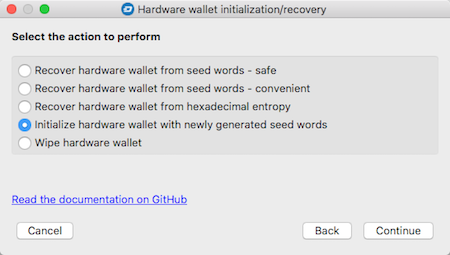
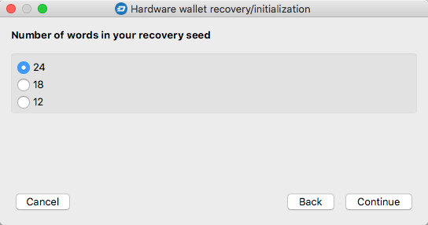
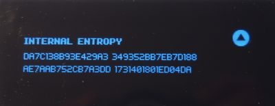
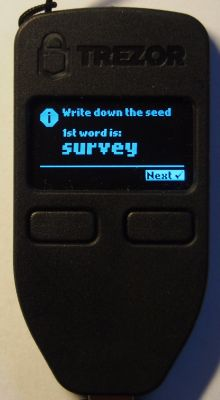
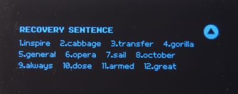

# Hardware wallet initialization using newly generated seed words
This functionality is only available for Trezor and KeepKey wallets – Ledger Nano S devices implement this in firmware, so the process is entirely controlled using the physical buttons.

This option is used to generate a brand new set of private keys. Two random number generators are involved in this process: one in the hardware wallet, and the other in the computer to which it is connected. The generated entropy (and words resulting from it) is a combination of both generators. The purpose of using this approach is to ensure maximum randomization.

#### Step 1: Select the type of hardware wallet in use in the first step of the wizard

#### Step 2: Select the `Initialize hardware wallet with newly generated seed words` option  

#### Step 3: Select the number of recovery seed words to be generated  
The more words, the lower the risk of two different people creating the same set of words. Even though the risk is effectively zero for 12 words, it is still recommended to choose the highest value, which is 24.  

#### Step 4: Confirm the generated entropy

#### Step 5: Confirm and write down the words
The device will begin to display the sequence of words constituting the recovery seed. These words should be written down and kept safe. The KeepKey wallet, which has a bigger screen, displays several words at once. After presenting the complete set of words, the device will show them all again – this is the last chance you will have to verify all words were noted down correctly.  

  

The device is initialized once this step is complete.