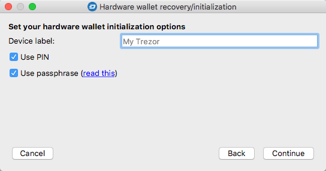
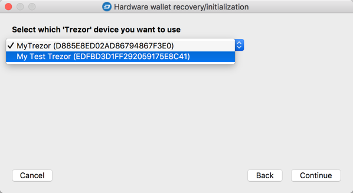
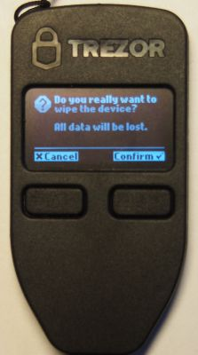
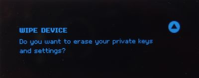
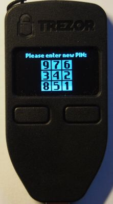
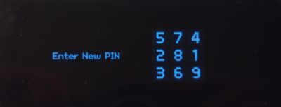
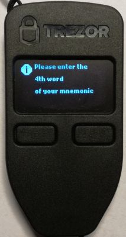
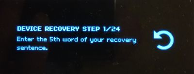
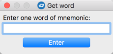
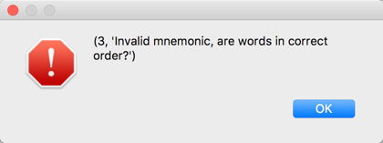

# Hardware wallet recovery - safe mode

For Trezor and KeepKey wallets, this is a standard recovery scenario. It is characterized by the user entering the individual words composing the recovery seed in a random order, with the number of the word to be entered shown only on the screen of the device. This makes it theoretically safe even on computers where malware may be logging everything typed on the keyboard. If this were the case, the malware would be able to capture the individual words, but not their order in the complete set, making the information useless.

#### Step 1: Select the type of hardware wallet in use in the first step of the wizard  

#### Step 2: Select the `Recover hardware wallet from seed words – safe` option  

#### Step 3: Select the number of words in your recovery seed  

#### Step 4: Define hardware wallet configuration options
Enter the device label and decide whether or not you wish to use a PIN and/or passphrase.  

#### Step 5 (optional): Select the device instance
This step will only be shown if there are multiple devices of the same type connected to the computer.  

#### Step 6 (optional): Confirm wiping the device
If the device is already initialized (it contains previously generated keys), it will ask you if you are certain it should be "wiped". Press the appropriate button on the device to confirm.  

 

#### Step 7: Enter a new PIN according to the matrix displayed on the device screen
The device will ask you to enter your PIN twice to verify it is correct.  

 

#### Step 8: Enter the recovery seed words
The number of the word to be entered next by the user will be presented on the hardware wallet screen. As mentioned before, the order is randomized for security reasons.  

While the device indicates the word number to be entered, DMT will present a dialog to enter the word:  

You will continue to see requests for individual words until all words of the recovery seed have been entered. The last word acts as a checksum – a mechanism that verifies whether both the words and their order are correct. The following message appears in the case of an error:  

In this case, you will have to start again and enter the words in the correct order. The following message appears once the process has been completed successfully:  

