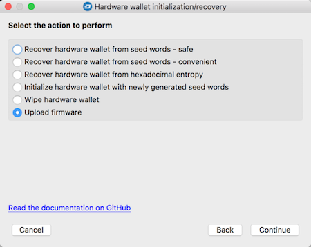
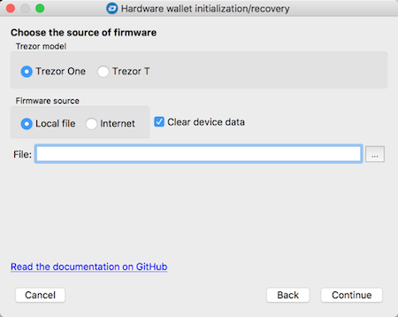
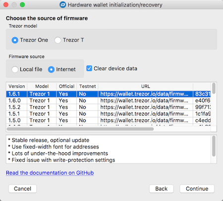
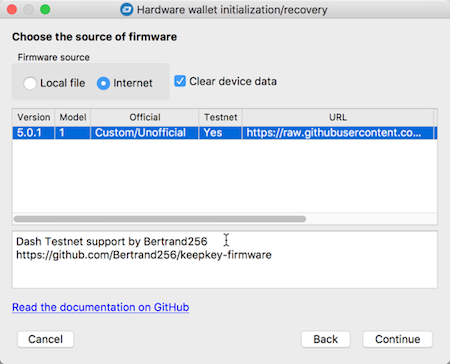
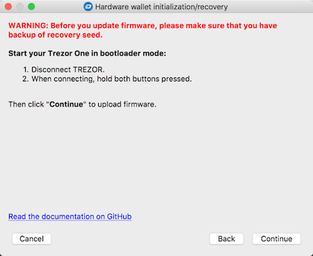

# Update hardware wallet firmware
None of the most popular hardware wallets supports Dash TESTNET in official firmware, so this feature can be useful if you would like to enable that support in your Trezor or Keepkey device. Both of them have publicly available firmware source code, so it's possible to anyone changing that code to enable features that are not officially available. 

For those who do not want to bother (or do not have knowledge) the compilation procedure, I have prepared custom firmwares with TESTNET support for Trezor and KeepKey. Files are available for download at the following address: https://github.com/Bertrand256/dash-masternode-tool/tree/master/hardware-wallets/firmware.

> **Important**: the latest versions of the Trezor One bootloader have a bug disallowing running custom firmwares, so until the situation is clarified, firmwares for this device, prepared by me will be hidden. Therefore currently, when it comes to support for Dash TESTNET, I have only published firmwares for Trezor T and Keepkey devices.

To automatically download firmware and install it in the device, you can use the `Tools->Hardware Wallet Initialization/Recovery` window.

### Procedure steps

1. Select the type of hardware wallet in use in the first step of the wizard

2. Select the `Upload firmware` option  
  

3. On the third page of the wizard, select your Trezor model (if selected Trezor hardware wallet in the first step), firmware localtion (local file, Internet) and whether you'd like to clear your device data memory before uploading firmware. I strongly recommend this if you are installing unofficial firmware - this step will remove your previous seed from your device.  
    

    Get firmware from Internet - here we have list of official firmwares for Trezor One:  
      

    Get firmware from nternet - here we have an unofficial firmware with TESTNET support for Keepkey device:  
    

4. In the last step, reconnect your device entering into bootloader mode, taking steps according to the information displayed on the form. Click `Continue` to initiate the last step - firmware installation:  
  