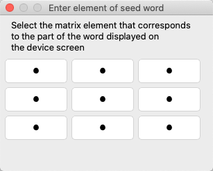
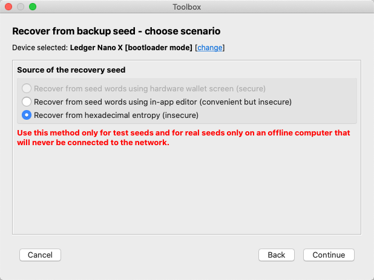

# Hardware wallet recovery

## Introduction

Hardware wallets must be properly prepared for operation before first use. This generally takes place in one of the following two scenarios:

- Initialization: a process that consists of generating a new set of private keys and corresponding addresses on the device.

- Recovery: a process that consists of restoring an existing set of keys (and addresses) that have previously been used, e.g. in another hardware or software wallet. This method is usually used when the previous device has failed, or we are simply "migrating our funds" to another device.

## Understanding the recovery seed

All three hardware wallets supported by DMT (Trezor, KeepKey and Ledger Nano S) support the BIP32/BIP44/BIP39 standards. Without going into too much detail, it is sufficient to know that as a result:

- the device stores an entire tree of private keys and corresponding payment addresses
- all of those keys are generated based on so-called *entropy* – which is essentially a unique number with a length of 16 to 32 bytes
- for a person to be able to memorize the entropy, it is converted into a set of 12 to 24 words, later referred to as the *recovery seed*

Initialization of the device is actually the process of generating new entropy and presenting it to a user as a set of words, while recovery is the same procedure in reverse – passing a set of words forming the recovery seed to the device, and then converting them to entropy inside the device. This entropy is the basis for generating an entire set of keys, which was so brilliantly described by Andreas Antonopoulos in his groundbreaking book "Mastering Bitcoin" (see the [Wallet Technology Details](https://github.com/bitcoinbook/bitcoinbook/blob/second_edition/ch05.asciidoc#wallet-technology-details) chapter).

### Step 1: Start the hardware wallet recovery wizard
Do this by clicking the *Tools->Toolbox* menu item or the *Toolbox* button on the main window toolbar, then click *Recover hardware wallet from backup seed*.  

Further steps depend on the selected recovery scenario.

## Recovery scenario using hardware wallet screen (secure)
For Trezor and KeepKey devices, this is standard recovery scenario. The idea behind this scenario is that the procedure is carried out using the hardware wallet screen in such a way that any malware that might be running on the computer will not have access to the parts of the seed being enetered.

### Step 2: select *Recover from seed words using hardware wallet screen*
  

> **Note.** The state of some options depends on the type of device you have connected: the last two scenarios apply only to Ledger Nano devices.

Click **Continue**.

### Step 3: select the number of words of your recovery seed

Click **Continue**.

### Step 4: set options and input method for words

* **Input type on device**: A method of entering words that are part of the recovery seed for Trezor One (which cannot accept words from its touch screen). The *Scrabled words* method involves entering individual words from the computer keyboard, but for the sake of security, the words are entered in a random order. The *Word matrix* method is based on indicating the elements of words with a matrix of buttons similar to the one used to enter PIN. The latter solution is safer.
* **Device label**: The label that will be assigned to the device (Trezor and Keepkey). This setting can be changed later from the [HW settings](other-features.md#changing-the-hardware-wallets-settings) dialog.
* **Use PIN**: It allows you to define whether you want to use PIN, which is recommended. This setting can be changed later from the [HW settings](other-features.md#changing-the-hardware-wallets-settings) dialog.
* **Use passphrase**: Lets you specify whether to use the BIP-39 passphrase standard or not. This setting can be changed later from the [HW settings](other-features.md#changing-the-hardware-wallets-settings) dialog.

### Step 5 (optional): Confirm wiping the device
If the device is already initialized (it contains previously generated keys), it will ask you if you are certain it should be "wiped". Press the appropriate button on the device to confirm.  

 

### Step 6: Enter a new PIN according to the matrix displayed on the device screen
The device will ask you to enter your PIN twice to verify it is correct.  

 

### Step 7: Enter the recovery seed words
The appearance of the windows depends on which method you have chosen to enter the words. 

#### Scrambled words
The number of the word to be entered next by the user will be presented on the hardware wallet screen. As mentioned before, the order is randomized for security reasons.  

While the device indicates the word number to be entered, DMT will present a dialog to enter the word:  

#### Word matrix

You will continue to see requests for individual words until all words of the recovery seed have been entered. The last word acts as a checksum – a mechanism that verifies whether both the words and their order are correct. The following message appears in the case of an error:  

In this case, you will have to start again and enter the words in the correct order. The following message appears once the process has been completed successfully:  

## Recovery scenario using "convenient" mode
This mode is only applicable to Ledger Nano devices.

This procedure differs from secure mode in that the words composing the recovery seed are entered in a dedicated editor, all visible at the same time. While this method is more convenient than entering each word separately in a random order, it also has some important consequences impacting the security of the procedure.

> **Remark concerning Ledger Nano S wallet**  
> Before launching this function, you should put the device in Recovery mode.

> **Remarks on security**  
> In one of the steps of this scenario, all the words of the recovery seeds will be visible on the computer screen simultaneously. This means that it should only be performed either on an offline computer or for testing purposes. By "offline" we mean a system that is not and will never be connected to the Internet.
>
> For the purposes of this scenario, it is also best to use a system launched from a live CD (as described [here](running-dmt-on-linux-live-cd.md)), that ceases to exist as a system after turning if off. This ensures that there is no trace of confidential information stored anywhere.

### Step 2: Select *Recover from seed words using in-app editor*  

Click **Continue**.

### Step 3: Select the number of words in your recovery seed   

Click **Continue**.

### Step 4: Enter all recovery seed words in the corresponding fields  

### Step 5: Define hardware wallet configuration options

  
-  Use PIN: see above
-  Use passphrase: check this option if you are using BIP39 passphrase, and you want to save it in the device memory. This may not seem like the best idea, but for this device, the only alternative is to enter the passphrase whenever needed using the two physical buttons. This is annoying for short character strings, and can be a nightmare for long ones. Nevertheless, this option has been designed reasonably well by the manufacturer, providing as much security as possible in such situations. The passphrase is only activated if the user enters the Secondary PIN when connecting the device – otherwise, the basic set of keys is activated instead.

After clicking **Continue** recovery seed will be loaded to your device.

## Recovery scenario using entropy
This mode is only applicable to Ledger Nano devices.

> **Note**. For security reasons this procedure should only ever be performed on offline systems.

This option can be useful for people storing recovery seeds in the form of entropy (a number between 12 and 32 bytes) or for people who don’t trust the random number generators used in hardware wallets to generate a new set of words. Such users may prefer to use extremely reliable sources of random data, such as a multiple coin toss. In these situations, for entropy corresponding to the 24 words of the recovery seed, we perform 256 coin tosses and treat each result as a binary "0" or "1". We then convert the binary string to hexadecimal, which is entered according to the description below.

### Step 2: Select the *Recover from hexadecimal entropy* option
  

Then click **Continue**.

### Step 3: Enter the entropy as a hexadecimal string – 16, 24 or 32 bytes long
The length of the entered entropy will have an impact on the resulting number of seed words.

### Step 4: Define hardware wallet configuration options

  
The options are described [here](#step-5-define-hardware-wallet-configuration-options).

After clicking **Continue** recovery seed will be loaded to your device.

