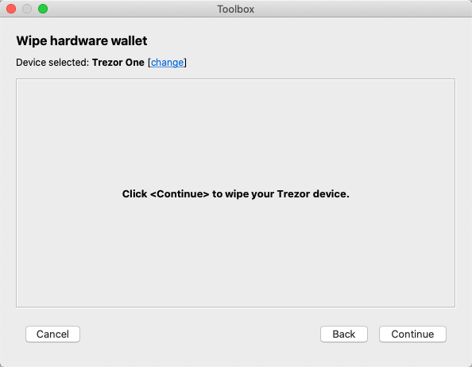

# Hardware wallet wiping
This is a simple two-step procedure that can be performed if it is necessary to clear the hardware wallet memory for some reason.

###Step 1: Start the hardware wallet wiping wizard
Do this by clicking the *Tools->Toolbox* menu item or the *Toolbox* button on the main window toolbar, then click *Wipe hardware wallet*.  

###Step 2. Confirm that you really want to wipe the device in the dialog
Do this by clicking **Continue**.  

Confirmation requests will be displayed on the device screen, which must be confirmed with the appropriate physical button. 