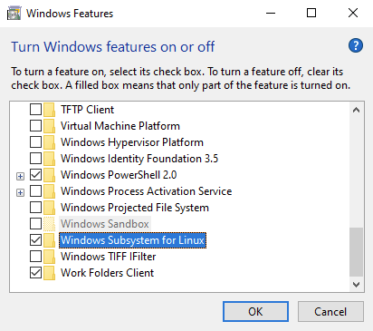
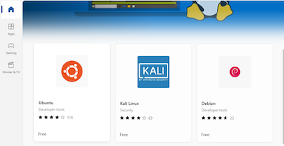
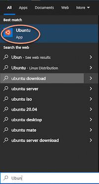
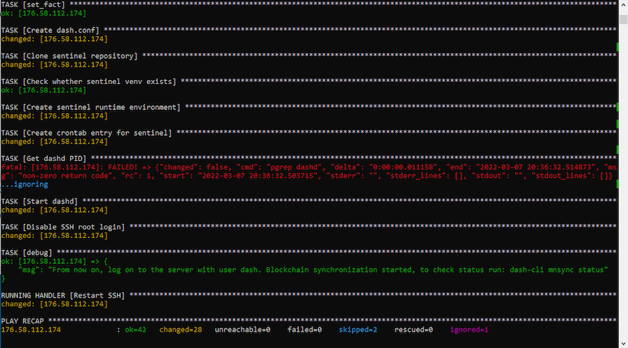

#Installing and configuring a Dash node with Ansible

The method described below basically performs all the steps described in  [Installing and configuring a Dash node using manual steps](installing-dash-node-manual.md), but using Ansible, so apart from the preparation steps, all the steps listed there are done here, but automatically.

Ansible is an automation software dedicated to run under Linux. It can be used on computers with macOS or Windows 10, though, but before you can do that, it is necessary to perform a few additional steps.

##Preparation steps
The steps to follow depend on what operating system you are using on your computer. The term *operating system*, as used in this chapter, refers to the operating system installed on the computer you are working on, or in other words - your client workstation.

###Preparation steps for Linux
####Step 1. Installing the necessary software
Start your Linux terminal and run the following commands:
```
sudo apt update
sudo apt -y upgrade
sudo apt -y install ansible sshpass git
```

####Step 2. Creating an SSH authentication key
By default, the prepared Ansible script configures the remote server so that after the installation is complete, you can only authenticate with your SSH key and not your password. You can disable this option in the Ansible configuration file, but it's not recommended because leaving the password authentication option on will expose you to brute force attacks from the Internet to take over your machine.

> **Note**. If you already have the `~/.ssh/id_rsa` file on your computer, it means you have already done it before, and you can skip it.

To generate an SSH key-pair run the following command from your terminal:
```
ssh-keygen
```
In this step you can set some options (such as additional password encryption of newly created keys) but you can also leave all options default. If leave the default options, your private key will be stored in the file `~/.ssh/id_rsa` and your public key in the file `~/.ssh/id_rsa.pub`.

[Next steps](#running-the-installation-with-ansible)

###Preparation steps for macOS
####Step 1. Installing *Homebrew*:

  ```
  curl -fsSL -o install.sh https://raw.githubusercontent.com/Homebrew/install/master/install.sh
  /bin/bash install.sh
  ```

  Installation takes about 5 minutes to complete. More details: [https://brew.sh/](https://brew.sh/).

####Step 2. Installing the necessary software
Start your macOS terminal and run the following commands:
  ```
  brew install hudochenkov/sshpass/sshpass
  brew install ansible git
  ```

####Step 3. Creating an SSH authentication key
Go through all the steps in the [Linux](#step-2-creating-an-ssh-authentication-key) section related creating an SSH key.

[Next steps](#running-the-installation-with-ansible)

###Preparation steps for Windows 10
You have two options:
* Use virtualization software like VirtualBox to install a virtual machine based on Linux (I suggest you choose the Ubuntu 20.04 distribution). In this case, after installing the VM, follow all the steps in this document dedicated to Linux from the VM.
* Use *Windows Subsystem for Linux* (WSL). WSL is an optional Windows 10 component that allows you to run Linux programs from the Windows text console. Since it also allows you to use a Linux SSH program to connect to remote hosts, it's a great option in my opinion in place of Putty, used for this purpose until now.

####Step 1. Installing WSL
Reference: [https://docs.microsoft.com/en-us/windows/wsl/install](https://docs.microsoft.com/en-us/windows/wsl/install).

* Start cmd.exe and run the following command from it:
  `OptionalFeatures.exe`
* Check the box next to *Windows Subsystem for Linux* and click **OK**:  
  
* Start cmd.exe as Administrator and execute the following command:
  ```
  wsl --list
  ```
  You should see something like this, but if not, look at the notes below:
  ```
  Windows Subsystem for Linux Distributions:
  Ubuntu (Default)
  ```

  > **Note**. If you see a message like this:
  > ```
  > Windows Subsystem for Linux has no installed distributions.
  > Distributions can be installed by visiting the Microsoft Store:
  > https://aka.ms/wslstore
  > ```
  > then start your web browser and go to [https://aka.ms/wslstore](https://aka.ms/wslstore), find *Ubuntu*, klick on it and finally click *Get*:  
  >   
     
  Once this step is complete, the Open button will appear in place of the Get button, which you should click.  
    
  > At the end of the installation, a Linux WSL terminal window should open in which you will be asked for the username (and password) you will use in the newly created Linux environment.

  You will be able to start your Linux WSL terminal from the start menu:  
  

####Step 2. Installing the necessary software inside your WSL Linux instance
Start the WSL Linux terminal and go through all the steps of the [Linux](#preparation-steps-for-linux) section.
> **Note**. SSH private key generated inside WSL Linux will be available only from there. If you want to use it with your Putty, you need to extract it from the WSL instance and convert it to Putty format using PuttyGen.

##Running the installation with Ansible
Launch the terminal program on your computer (or the WSL Linux terminal if you are using Windows 10).

####Step 1. Get the DMT sources
```
cd ~
git clone https://github.com/Bertrand256/dash-masternode-tool
```

####Step 2. Review and, if necessary, adjust the configuration to your needs
The configuration can be found in the `dash-masternode-tool/ansible/install-dash-node/install-dash-node-vars` file. It is in the format of the Ansible variables file, but it (the format) is simple enough, that needs no additional explanation.

You may not need to change anything, but if you do, open the configuration file in your preferred text editor (e.g. nano):
```
nano ~/dash-masternode-tool/ansible/install-dash-node/install-dash-node-vars
```
After making changes, save them (Ctrl + O, ENTER) and exit the editor (Ctrl + X).

**Description of variables**

| Variable name                         |Description   |
|---------------------------------------|--------------|
| **dashuser**                          |Name of the linux account that will be created on the Dash server-node (default: dash).|
| **dashuser_password**                 |The password for the account specified as *dashuser* (see above). It can be left blank as it will be specified with command line in this chapter. |
| **dashnode_testnet**                  |Set to true if the Dash node is to run work within testnet instead of mainnet (false by default). |
| **ssh_additional_pubkey**             |If you want an SSH key other than the one that exists in your local `~/.ssh/id_rsa.pub` file to be added to the authorized_keys on the remote node, you can specify it here, otherwise leave it empty.|
| **ssh_disable_password_login**        | If the value is set to true (default), the Ansible script will secure access to the Dash node by disabling password login and leaving only SSH key authentication.|
| **ssh_disable_root_login**            | If the value is set to true (the default), the Ansible script will secure access to the Dash node by disabling the root user login. In that scenario, after finishing the installation Ansible script, you will be able to authenticate to the user specified above as *dashuser* and from there execute administrative commands using sudo.|
| **ssh_add_local_id_rsa_pubkey**       | If set to true (default), Ansible will add your local `~/.ssh/id_rsa.pub` file to the `authorized_keys` on the remote dash node under the dashuser user (and root as fallback), making it possible to authenticate with an SSH key.|
| **swap_size**                         | Swap file size.|

####Step 3. Run the Ansible script
```
cd ~/dash-masternode-tool/ansible/install-dash-node
ANSIBLE_HOST_KEY_CHECKING=False ansible-playbook --ask-pass -i HOST_IP, -e "ansible_user=root dashuser_password=DASHUSER_PASS" install-dash-node-ubuntu.yml
```

Replace capitalized strings with the appropriate values:
* **HOST_IP**: IP address of your VPS server on which you install Dash node
* **DASHUSER_PASS**: The password to be set for the newly created linux user who will own the Dash software (above referred to as dashuser).

The script should complete in up to a few minutes with the following message:  


The outcome should be that the server has been properly configured to work as a Dash node and finally the *dashd* program has been launched, starting its synchronization with the Dash blockchain. This process will probably take up to several hours, and you can check its status by executing the `dash-cli mnsync status` command periodically.

The operation is complete if the *AssetName* field has value *MASTERNODE_SYNC_FINISHED*:
```
{
  "AssetID": 999,
  "AssetName": "MASTERNODE_SYNC_FINISHED",
  "AssetStartTime": 1645483294,
  "Attempt": 0,
  "IsBlockchainSynced": true,
  "IsSynced": true
}
```

> **Note**. From now on, instead of the *root* user, log in to the server as the user specified by the *dashuser* parameter.

##Troubleshooting
###Problem 1: `man-in-the-middle attack` error message when trying to connect win an SSH terminal.
Entire error message:
```
@@@@@@@@@@@@@@@@@@@@@@@@@@@@@@@@@@@@@@@@@@@@@@@@@@@@@@@@@@@
@    WARNING: REMOTE HOST IDENTIFICATION HAS CHANGED!     @
@@@@@@@@@@@@@@@@@@@@@@@@@@@@@@@@@@@@@@@@@@@@@@@@@@@@@@@@@@@
IT IS POSSIBLE THAT SOMEONE IS DOING SOMETHING NASTY!
Someone could be eavesdropping on you right now (man-in-the-middle attack)!
It is also possible that a host key has just been changed.
The fingerprint for the ECDSA key sent by the remote host is
SHA256:LfWu5g2kJpVbn42ckmH4skX48C+QlmcvreBxnJfW+6w.
Please contact your system administrator.
```

**Reason**: You've probably reinstalled the operating system on your VPS, which changed the server's SSH key with respect to the one your local computer has stored for the same IP address.

**Resolution**: Open your local `~/.ssh/known_hosts` file in a text editor, locate the line with the IP address (or hostname) of your VPS, delete it and save the changes.
