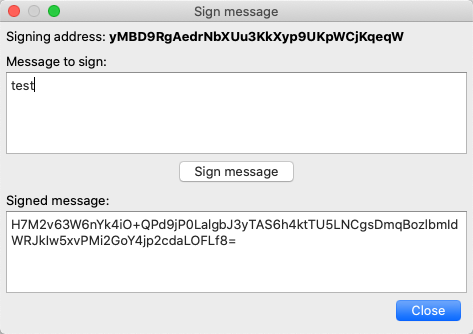
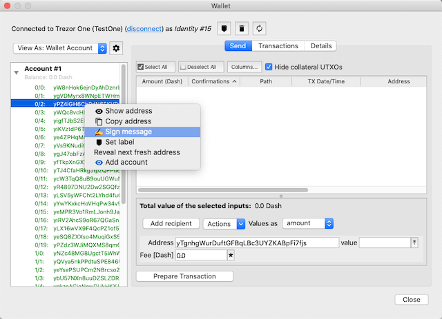
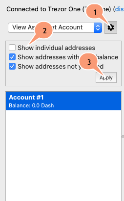
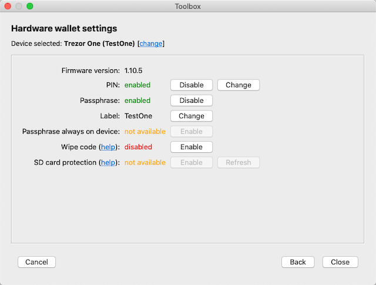
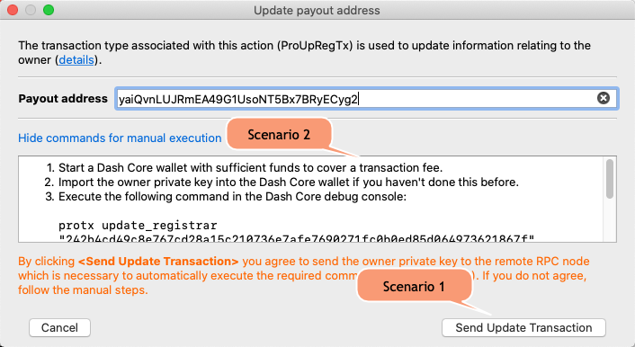
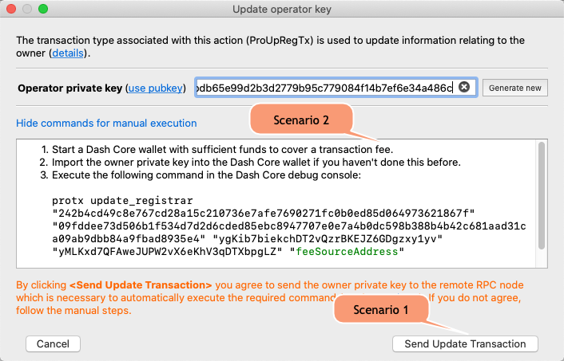
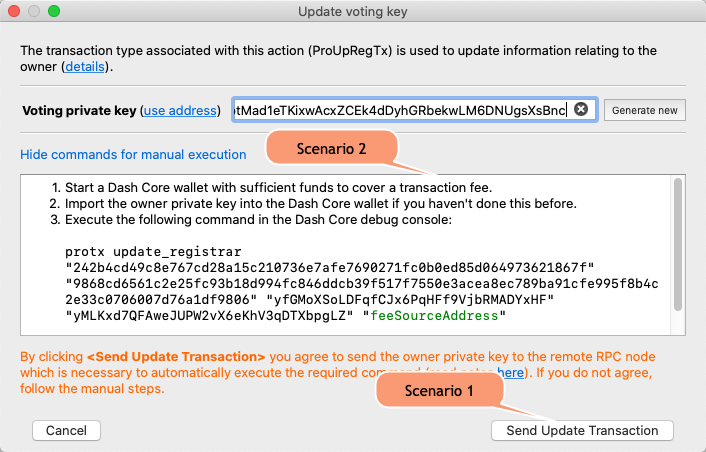
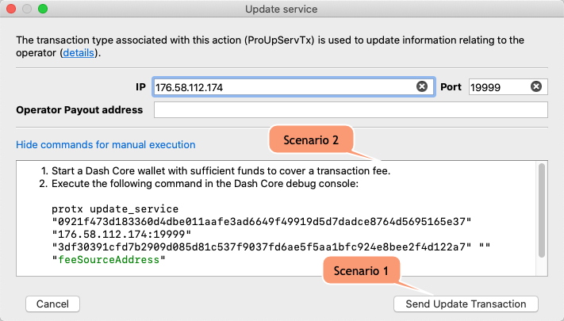
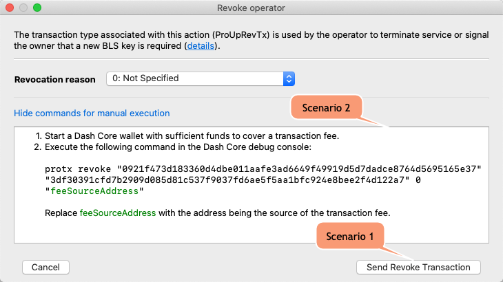

#Other features

##Signing messages with masternode private keys
Sometimes you may need to sign a message with one of the keys associated with the masternode: owner key, voting key, or collateral key. To do this, after selecting a given masternode, expand the menu associated with the "MN actions" button and select the appropriate action.  

##Signing messages with hardware wallets
From the wallet functionality, you can sign a message using any address controlled by it. To do this, open the Wallet window, expand the list of addresses within the selected account, click the desired address and then open the context menu by right-clicking.   

If the triangular address expansion button is not visible, you must enable the corresponding option in the local configuration options, as shown in the following screenshot:  

##Changing the hardware wallets settings
This functionality allows you to change the settings of Trezor and Keepkey hardware wallets. It is useful because not all settings are exposed through the official GUI of the wallet manufacturers. For some of them you have to use separate command line tools which makes it very difficult for non-technical people to use this feature. By hiding some options, many owners of these devices are simply not aware of some hidden but useful functions that the device has.

To use this functionality, launch the Toolbox window (Tools->Toolbox menu or Toolbox button on the toolbar).  

Click *Hardware wallet settings* to show the *Hardware wallet settings* page:  

> **Note**. The list of options available on the window depends on the type and model of device you currently have connected and is most extensive for Trezor devices. The following will describe the options available for Trezor wallets.

###PIN
This option allows you to enable or disable PIN protection for the device or to change the PIN itself.

Available for: Keepkey, Trezor One and T.

###Passphrase
This option allows you to enable or disable the use of a BIP-39 compliant passphrase, a feature that the Trezor device manufacturer refers to as hidden wallet. This standard and its use in practice is descriped here: [Passphrase](https://wiki.trezor.io/Passphrase).

Available for: Keepkey, Trezor One and T.

###Label
This functionality allows you to change the label assigned to a device, which is especially useful if you have more than one device.

Available for: Keepkey, Trezor One and T.

###Passphrase always on device
This functionality allows you to specify whether the BIP-39 passphrase is to be entered on the hardware wallet screen or from a client application running on a computer. Doing it from the device screen gives additional protection, as malware would not be able to learn the contents of the passphrase being sent by eavesdropping on USB transmissions, so the author recommends enabling this option for all Trezor T users. Since only the Trezor T model has the ability to enter passphrase on its screen, this option applies only to that model. 

Available for: Trezor T.

###Wipe code
This option allows you to set an additional PIN the entering of which on the device will cause its complete wiping. This is a rather ingenious type of additional security for your device, the idea of which is outlined in the following document from the Trezor vendor: [User manual:Wipe code](https://wiki.trezor.io/User_manual:Wipe_code).

Available for: Trezor One and T.

###SD card protection
This option is yet another way to secure your Trezor wallet (Model T only) by using an additional SD card, without which the device is unusable. This is useful if your device is exposed to third-party access - the SD card acts as something of an extra security key here. This functionality is described here: [User manual:SD card protection](https://wiki.trezor.io/User_manual:SD_card_protection). 

Available for: Trezor T.

##Restoring hardware wallets with a recovery seed
The topic is documented [here](hw-recovery.md).

##Hardware wallet initialization with newly generated seed words
The topic is documented [here](hw-initialization.md).

##Wiping hardware wallet
The topic is documented [here](hw-wiping.md).

##Updating the masternode payout address
Sometimes it is necessary to change the Dash address to which the masternode earnings will be sent. The operation is very simple and the steps are as follows:

####Step 1. Launch the *Update payout address* dialog
To do this, in the list of masternodes in the main window, select the masternode for which you want to make the change, then expand the context menu under the **MN actions** button and click the **Update Payout Address** item.

####Step 2. Enter the new payout address

####Step 3. Publish an update transaction
You have two options for doing this:
* using public RPC nodes: to do this, click the **Send Update Transaction** button (Scenario 1), bearing in mind that you must have properly configured connections in the application options (see here)
* using your own Dash node: follow the steps outlined in the description box of the window (Scenario 2) 

##Updating the masternode operator key
You may want to do this operation, for example, when you change your masternode operator or after changing your VPS provider.

####Step 1. Launch the *Update operator key* dialog
To do this, in the list of masternodes in the main window, select the masternode for which you want to make the change, then expand the context menu under the **MN actions** button and click the **Update Operator Key** item.

####Step 2. Enter the new operator key
Here you have the option of entering a private key or a public key. Which option you choose depends on your situation and is described in more detail [here](registering-masternode.md#2-start-the-masternode-registration-wizard-and-fill-in-the-initial-data).

####Step 3. Publish an update transaction
You have two options for doing this:
* using public RPC nodes: to do this, click the **Send Update Transaction** button (Scenario 1), bearing in mind that you must have properly configured connections in the application options (see here)
* using your own Dash node: follow the steps outlined in the description box of the window (Scenario 2) 

##Updating the masternode voting key
You might want to do this operation if you previously delegated the voting activity to another person by sharing the voting key with him, but now you want to take that back. In such a situation, a new key should be generated and published on the Dash network as the key in effect.

####Step 1. Launch the *Update voting key* dialog
To do this, in the list of masternodes in the main window, select the masternode for which you want to make the change, then expand the context menu under the **MN actions** button and click the **Update Voting Key** item.

####Step 2. Enter the new voting key
You can enter the externally generated key or generate a new one here by clicking the **Generate new** button.

####Step 3. Publish an update transaction
You have two options for doing this:
* using public RPC nodes: to do this, click the **Send Update Transaction** button (Scenario 1), bearing in mind that you must have properly configured connections in the application options (see here)
* using your own Dash node: follow the steps outlined in the description box of the window (Scenario 2) 

##Updating the masternode IP, port and operator payout address
You perform this operation as an operator, so it concerns those aspects for which the operator is responsible. You might want to do this in several situations, for example when you change your VPS service (because the IP address changes) or to specify your payout address to which the operator portion of the masternode reward (defined during the mn registration process) is to be sent. 

####Step 1. Launch the *Update service* dialog
To do this, in the list of masternodes in the main window, select the masternode for which you want to make the change, then expand the context menu under the **MN actions** button and click the **Update Service (IP/port/operator payout address)** item.

####Step 2. Enter the details
Enter the details according to your needs. If you are not using masternode payment split into owner and operator part, leave the "Operator Payout Address" field blank.

####Step 3. Publish an update transaction
You have two options for doing this:
* using public RPC nodes: to do this, click the **Send Update Transaction** button (Scenario 1), bearing in mind that you must have properly configured connections in the application options (see here)
* using your own Dash node: follow the steps outlined in the description box of the window (Scenario 2) 

##Revoking masternode
Actually, you very rarely need to do this operation. If you give up masternode at all, spending the mastenrode's collateral transaction will automatically unregister the masternode, so you don't need revoking in this case. You may need an explicit revoke operation, for example when due to some unique problems, you want to re-register the masternode with the same IP address or operator key.

####Step 1. Launch the *Revoke operator* dialog
To do this, in the list of masternodes in the main window, select the masternode for which you want to make the change, then expand the context menu under the **MN actions** button and click the **Revoke Masternode** item.

####Step 2. Enter the revokation reason
This isn't very important information, co you can leave the devault value *Not Specified*.

####Step 3. Publish an update transaction
You have two options for doing this:
* using public RPC nodes: to do this, click the **Send Update Transaction** button (Scenario 1), bearing in mind that you must have properly configured connections in the application options (see here)
* using your own Dash node: follow the steps outlined in the description box of the window (Scenario 2) 

