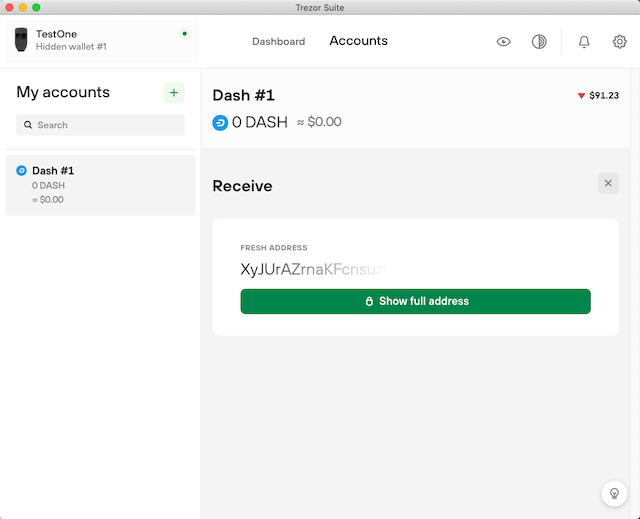

##Preparing a collateral transaction
The collateral transaction is a necessary element for running a masternode and its purpose is to (a) confirm that the masternode owner has 1000 Dash under his control and (b) that he assigns it to a specific masternode. Since masternode ownership comes with a compensation, the system is designed in such a way that the same transaction cannot be used multiple times (in more than one masternode).

Technically, it's a regular transaction but with a value of exactly 1000 Dash, which is sent to an address you control (for our purposes it's an address controlled by a hardware wallet). This means that you have a 1000 Dash UTXO (aka coin) on that address.

> **Note**: the same Dash address can contain more than one collateral transaction, e.g. for other masternodes, but it is important that each transaction is assigned to only one masternode. It is recommended that the wallet account (BIP44) you use to "park" collateral transactions is not also used by you for daily transactions. The reason for this is that the official wallet GUIs provided by hardware wallet manufacturers do not have a "coin control" function allowing you to block the spending of selected UTXOs. Therefore, when sending some funds (e.g. by paying for goods), you may accidentally spend a collateral transaction, which will cause the masternode to be deregistered by the Dash network.

###Preparation of collateral transaction using Trezor hardware wallet as an example
Here we will present the general procedure using the Trezor device. The procedure for Ledger Nano and KeepKey are not different in concept and will not be presented here.

####1. Download and install the official program for Trezor wallet, which is Trezor Suite

####2. Choose the account you wish to use for your masternode collateral transaction(s)
The list of accounts is displayed in the panel on the left. If you want to use a dedicated ("clean") account, click the "+" button next to the "My accounts" label to make the new account visible.
Select the account by clicking on its label.

####3. Get a Dash address to which you will send the 1000 Dash transaction
To make the address visible, click the button "Receive" and then click "Show full address" to show the entire address.

The window with the address details will be shown:  

####4. Test the address before you send the whole amount to make sure you have control over the address
* Send a small amount (e.g. 0.1 Dash) to the address you obtained in the previous step.
* After you receive your test transaction, send it back to make sure you have control over the address.

####5. Create a collateral transaction
After making sure that you were able to send a transaction from the prepared address, send a transaction worth exactly 1000 Dash to the address.

The hash of the generated transaction will be used in the masternode registration process, but you don't need to note it down as *Dash Masternode Tool* will help you locate it.
