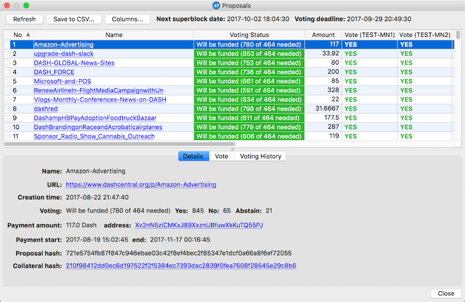
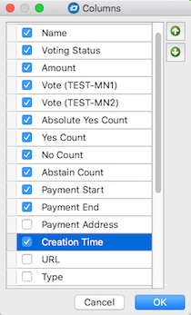
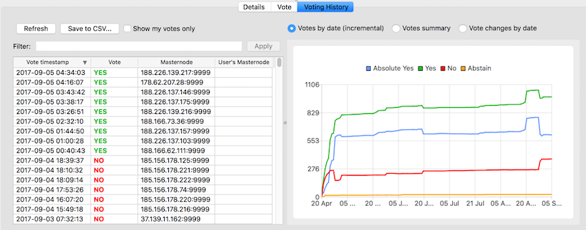
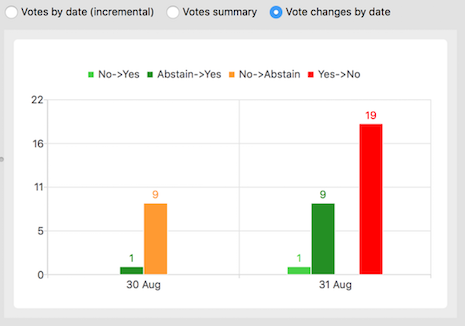
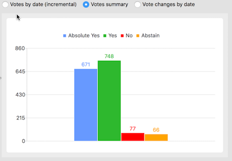
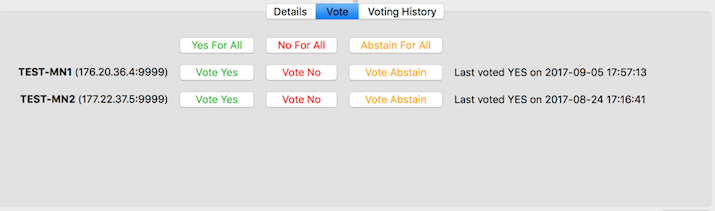
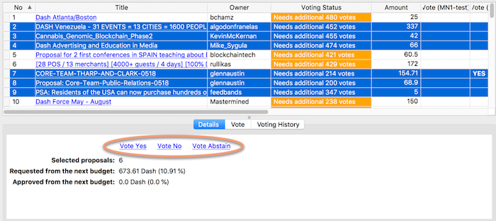
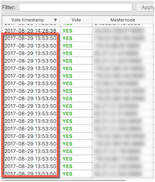
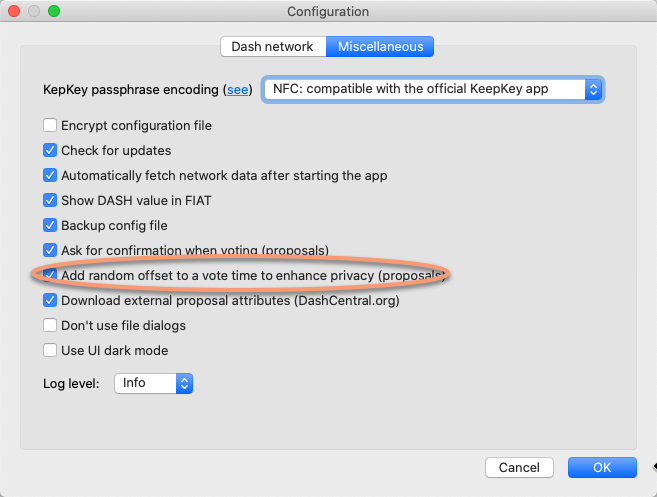

## Voting for proposals
One of the advantages of owning a masternode is that you can vote on proposals submitted by members of the community. These proposals cover a wide variety of topics, but the idea is that its implementation should add some value to the Dash community.

Voting on proposals can be done from the Dash Core debugging console, but it is quite difficult for it do there. Therefore, in addition to casting votes itself, DMT provides the functionality of presenting a list of proposals with all their details, which greatly improves decision-making.

To use these features, open the *Proposals* window by clicking the **Proposals** button in the main application window or the **Tools->Proposals** menu item. The following window appears:  

The first time you open the window, it will take a few minutes for the application to retrieve data on all the proposals currently maintained by the network, as well as the votes cast on them by masternodes. That data is saved to a cache database, so the opening the window should be faster once the data in the local cache.

The upper part of the window shows a list of proposals in a table, with several common proposal attributes visible in columns. You can control visibility and the display order of the columns by clicking the `Columns` button and enabling or reordering the columns of interest to you in the `Columns` dialog.  

In the *Proposals* dialog, you can:
 * View the list of all the currently available proposals and associated details.
 * View the list of votes cast on particular proposal.
 * Cast a vote on proposals (if a masternode is configured in *DMT*).
 * Save proposal and vote data to a CSV file for further analysis.
 * View charts showing voting progress over time.
 * Filter proposals by its properties: name, title, proposal owner

### Reviewing proposal details

All key proposal details can be viewed on the *Details* tab in the lower section of the *Proposals* window (see screenshot above).

### Reviewing voting details

On the *Voting History* tab you can view:
 * A list of all votes, along with the vote timestamp and voting masternode.
 * An incremental chart of votes over time.
 * A chart of changed votes over time (MNOs can change their vote at any time during the voting period).
 * A chart summarizing YES, NO and ABSTAIN vote counts.  
      

    Vote change chart:  
      

    Vote summary chart:  
    

### Casting votes

In the main proposals list, select the proposal(s), you'd like to vote on.

Open the *Vote* tab in the lower section of the *Proposals* window. You will see one row of voting buttons (*Yes*, *No*, *Abstain*) for each masternode registered in the application, and an additional row of buttons at the top to cast votes using all masternodes registered in the application:  

Alternatively, you can vote on the *Details* tab, using the links from the top of the tab, but remember, that this option will not allow you to vote with a specific masternode - votes are cast on behalf of all masternodes you have in your configuration:  

#### Privacy

If you own several masternodes, you should consider that casting a vote with all of them simultaneously is in effect publicly linking all the nodes to a single owner, which may be considered a privacy risk. The following screenshot highlights this point:  
  

Fortunately, there is an easy way to mitigate this type of timing attack. *DMT* can add a random offset (within a range of +/- 30 min) to the voting time for each of configured masternode, so clicking one of the **Yes/No/Abstain for all** buttons will result in a different voting timestamp for each masternode, as seen by the network. This feature can be enabled using the **Add random offset to a vote time to enhance privacy** option, as shown in the screenshot below:  

