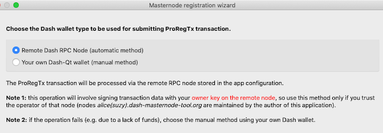

# Registering a masternode

Registration of a deterministic masternode is a process of adding a
masternode to the **Deterministic Masternode List** - a list
which after activating the **Spork 15** parameter will start to be used
by the network to accomplish the functionalities related to
masternodes. The registration process involves sending a special
transaction (**ProRegTx**) in which all the necessary information is
provided.

The scope covered in this document applies only to what directly relates
to the DMT functionalities, and it focuses on the migration from
nondeterministic to deterministic (DIP3) masternodes. To get familiar
with a broader context in this matter, read the following document:
[Dash 0.13 Upgrade Procedure](https://docs.dash.org/en/stable/masternodes/dip3-upgrade.html#masternode-registration-from-dmt),
which I highly recommend.

It's worth noting here, that this process can be performed completely
independently of DMT (using the Dash Core wallet), however, the
inclusion of this function in DMT is aimed at the maximum facilitation
of this process.

## 1. Create a new masternode entry in Dash Masternode Tool
* After starting the *Run Dash Masternode Tool* application, click the **add a new one** link (if your configuration is empty):  
  

  or select **Add New Masternode Entry...** under the **MN actions** button (if there are any masternodes already in the configuration):  
  


* Fill in the following fields on the *Add new masternode* form:
  * **Name**: The description under which the masternode will appear in your configuration. It can be any name, but you can also leave the default name generated by the application.
  * **IP** and **port**: The IP address and tcp port number that your dash daemon is running on. As for the port number, for masternodes running on mainnet, it should be 9999.
  * **Collateral address** (see the note below): The Dash address at which your collateral transaction "resides".
  * **path** (see the note below): The BIP32 path in your hardware wallet under which the *collateral address* is located.
  * **Collateral TX hash** and **index** (see the note below): Hash the collateral transaction you are dedicating for this masternode. Preparing a collateral transaction is described [here](preparing-collateral-transaction.md).
  
  Leave all other fields blank.  
  

  >**Note**: instead of manually entering the *Collateral address*, *path*, *Collateral TX hash*, and *index* fields, you can use ask DMT for help by clicking the *Locate collateral* button. After doing that, the application will scan the contents of your hardware wallet and display all transactions that can act as collaterals, which are those worth 1000 Dash. Please take into consideration that if there are many transactions in your wallet, the scanning may take quite a long time. 
     
   After scanning, you will be asked to select the collateral transaction you want to assign to the masternode, if there is more than one:  
   
 
* After filling in the data, press the *Apply changes* button.

## 2. Start the *Masternode registration wizard* and fill in the initial data
* Select the masternode from the list in the main DMT window.
* Click the **Register Masternode...** menu item under the **MN actions** button.
* Fill in the required data:  
    
  * **Payout addres** (1): The default value is the address associated with the *collateral transaction*, but you can enter any valid Dash address here. Thanks to this, you get the option of separating the payout address from the collateral address, by placing them in different wallets or wallet accounts.
  * **Operator reward** (2): Here you have the possibility of splitting the masternode rewards between owner and operator. To use this feature, uncheck the checkbox and specify what percentage of the reward will go to a Dash address of the masternode operator (which can be specified at a later stage).
  * **Operator private key** (3): What information you enter here depends on whether you are the operator of your masternode yourself or you have outsourced it to some third party:
    * If you are the operator, leave the proposed value unchanged.
    * If you employ an external masternode operator that accepts operator **private keys** of his clients (mn owners), do not change the generated value, just pass it to the operator, since it is required to properly configure a masternode.
    * If you employ an external masternode operator who provided you with the operator's **public key**, then click the **use pubkey** link and enter that key into the field on the right.
* Click the **Continue** button at the bottom right of the wizard.

## 3. Masternode registration
There are three methods of masternode registration using DMT:
- **Automatic method using "public" RPC nodes**: choose this method if you don't have, or you cannot easily run Dash Core (for example, you don't have disk space for blockchain data) or you feel uncomfortable using a terminal-type user interface. This is the simplest method, so it's deditacted especially for people with less technical experience.
- **Automatic method using your own RPC node**: choose this method if you have your own Dash Core synchronized with the network and the RPC interface and indexing enabled.
- **Manual method using own your Dash node**: choose this method if you have your own Dash Core synchronized with the network but without the RPC interface or indexing enabled.

### Scenario 1: Automatic method using "public" RPC nodes
The advantage of this method is its simplicity but the disadvantage is the need to send the owner private key to the remote RPC node. This key is necessary to sign the payload data being part of the *ProRegTx* transaction, which is created on the remote node ([details](https://github.com/dashpay/dips/blob/master/dip-0003.md#registering-a-masternode-proregtx)). If this raises your concerns (e.g. you do not trust the RPC node
operator), choose another method.

>  **Note 1**. The RPC nodes preconfigured in DMT (alice, suzy) are maintained by the author of the DMT application (that is by me). For my part, I can ensure that no sensitive information (such as private keys) is logged anywhere. All parameters are passed to the Dash daemon, and after signing the transaction they are purged.


>  **Note 2**. What would happen if the operator key fell into the wrong hands? Taking into possession of this key does not allow the theft of the collateral (which is controlled by hardware wallet), but may have some financial aspect. Namely, it allows sending a  [ProUpRegTx](https://github.com/dashpay/dips/blob/master/dip-0003.md#updating-registrar-of-masternode-proupregtx) transaction, which allows to change the payout address. In an extreme case, you may lose your masternode reward, one or a few,  depending on when you would notice the change. Protection against this is quite simple - it is enough to monitor changes of the masternode payout address and owner key using data available on the Dash network. This feature is implemented in DMT under the **Refresh status** button. If there is a change in relation to the data stored in the configuration, a warning will be displayed. If something like this happens, you must immediately generate a new *ProRegTx* transaction with a new set of keys.

#### Step 1.1. Select the registration method 
Select the **Remote Dash RPC Node (automatic method)** option, then click **Continue**.



#### Step 1.2. Confirm the message related to the operation of signing data on your hardware wallet  
At this step, the wizard executes two operations on the remote Dash node (**register_prepare** and **register_submit**), between which you will be asked to sign a special message with the hardware wallet controlling the masternode collateral. The resulting signature is supposed to prove that you really have the collateral private key under your control and that you're not trying to hijack someone else's collateral transaction.


If the operation completes without an error, the wizard will
automatically go to the summary page.

#### Step 1.3. Summary and final actions
  

The summary page will show all relevant values (e.g. private keys) used
during the process. Most of them will be copied to the masternode
configuration in DMT, nevertheless it's worth saving them in a separate
file.

Note the message at the bottom regarding *masternodeblsprivkey* - we will need this information at the next step.

Click **Close**.

### Scenario 2: Automatic method using your own RPC node
This method works identically to the previous one, but utilizes your own
RPC node to interact with the Dash network. Its advantage is that the
owner private key (which needs to be sent to the node) is under your
control all the time. The disadvantage of this method is that you need to 
prepare your own Dash full node with RPC interface and address
indexing enabled.

#### Step 2.1. Configure your own RPC node

Follow the steps described here:
[Connection to a local node](config-connection-direct.md)

Remember to configure the connection between DMT and your RPC node in the application network configuration window and disable all other connections.

> Note, that the RPC node has nothing to do with your masternode. This may be your local Dash Core instance, and actually it's the most convenient way under this scenario.

#### Step 2.2. Prepare funds to cover transaction fees
When you send a *ProRegTx* transaction you need to pay a transaction
fee, just like for a "normal" transaction. The amount required
for this operation is very small (about 0.000005), but still non-zero,
therefore your node must have these funds under its control. I suggest that
you prepare ten times the minimum amount (0.00005), which you should send to
any address of your node's wallet.

#### Step 2.3. Complete all the steps from the scenario related to using "public" RPC nodes
Follow the steps from scenario
[Automatic method using "public" RPC nodes](#scenario-1-automatic-method-using-public-rpc-nodes)


### Scenario 3: Manual method using own Dash node
The advantage of this method is that no private keys go outside your
computer and that to perform the steps it's enough to have access to a
Dash Core wallet, not necessarily with the RPC interface and indexing
enabled. The disadvantage is the need to manually execute some commands
from the Dash Core debug console, which may not be very comfortable for
some people.

#### Step 3.1. Install Dash Core and synchronize it with the network

#### Step 3.2. Prepare funds to cover transaction fees
See: [Prepare funds to cover transaction fees](#step-22-prepare-funds-to-cover-transaction-fees)

#### Step 3.3. Select the registration method 
Assuming that within the [Start the Masternode registration wizard and fill in the initial data](#2-start-the-masternode-registration-wizard-and-fill-in-the-initial-data) section you started the wizard and after filling in the data you went to the next step, choose the option **Your own Dash-Qt wallet (manual method)** and click the **Continue** button.
 
  

#### Step 3.4. Enter the address from which the transaction fee will be charged
This is the address where you have prepared funds to cover the transaction fees as described in the previous steps.


  
#### Step 3.5. Copy the command text generated by DMT in field "2"  
The text contains the `protx register_submit` command with all the
necessary parameters.


Hint: you can use the **Copy** button on the right.
  
#### Step 3.6. Execute the command in the Dash Core debug console
Paste the command into the and edit box at the bottom of Debug console
then press **Enter**.
  
#### Step 3.7. Copy the output of the command 
Select and copy the output text, including braces but nothing more.


  
#### Step 3.8. Paste the command output into field "3" (DMT) and click _Sign message with hardware wallet_  


Hint: you can use the **Paste** button on the right. 

Confirm the operation on your hardware wallet.

#### Step 3.9. Copy text from field "4" to the clipboard
The text contains the `protx register_submit` command with all the
necessary parameters.


Hint: you can use the **Copy** button on the right.
 
#### Step 3.10. Execute the command in the Dash Core debug console
  
#### Step 3.11. Copy the protx transaction number resulting from the command


This string will from now on identify your deterministic masternode.

#### Step 3.12. Paste the copied transaction number into field "5" in DMT.


Press the **Continue** button.

#### Step 3.13. Summary - final actions
Follow the step: [Step 1.3. Summary and final actions](#step-13-summary-and-final-actions)

## 4. Final configuration of the masternode dash daemon
The approach here depends on the type of operator handling your masternode, that is, if your operator is an external entity that has provided you with an operator key that is a **public key**, then you skip this section because it is up to the operator to perform the operations described here. 

If your operator is an external entity that expects you to give it an operator key of type private key, then you just give it to them and skip the rest.

The following actions only apply if you yourself are the operator of your masternode.

#### Step 4.1. Entering the operator key into the *dash.conf* file of your dash node.
In the [Summary and final actions](#step-13-summary-and-final-actions) step, DMT presented you with a configuration string containing the operator key to be placed in your masternode's dash node configuration, which is of the form: `masternodeblsprivkey=OPERATOR_PRIVATE_KEY`.

If you have this string copied, you will use it in the next step. If you don't have it, go to the masternode details in the main DMT window, click the button with an eye icon to the right of the *Ooperator private key* field (1), then when the previously hidden key content becomes visible, copy it to the clipboard (2). It will be used in the next step.  


* Log in with an SSH session to your VPS running your masternode daemon.
* Open the Dash daemon configuration file with your preferred text editor:
  ```
  nano ~/.dashcore/dash.conf
  ```
* Add the required configuration line to the file (you can append it to the end):
  ```
  masternodeblsprivkey=OPERATOR_PRIVATE_KEY
  ```
  replacing OPERATOR_PRIVATE_KEY with the operator's private key obtained in the previous step.
* Save your changes (Ctrl+O, ENTER) and exit the editor (Ctrl+X).

#### 4.2. Restarting the dash daemon
A restart of the Dash daemon is required for the changes to take effect.
* With your SSH session execute the following command:
  ```
  ~/.dashcore/dash-cli stop
  ```
* Wait until the `pidof dashd` command returns nothing.
* Start the Dash daemon again:
  ```
  ~/.dashcore/dashd
  ```
  
To check the status of a masternode from the point of view of its daemon, run the command: `~/.dashcore/dash-cli masternode status`.

## FAQ / troubleshooting
#### Can I register deterministic masternode more than once for the same collateral transaction?
Yes, you can do it as many times as you like, but keep in mind the
following:
* you have to wait until the previous ProRegTx is confirmed, otherwise
  you will get a **protx-dup** error
* every time you sent a new ProRegTx, you must use new owner, operator
  and voting keys, otherwise you will get a **bad-protx-dup-key** error
  
#### Can I modify the payout address without resetting the place in the payment queue?
Yes, you can do it. You can either do this from within *Dash Core* or use a graphical interface available in Dash Masternode Tool, which simplifies the process. In DMT, it is available under the **Update Payout Address** context menu item associated with the **MN actions** button in the main window.

#### My masternode has been PoSeBanned. What to do to make it active again?
If for some reason your masternode does not provide the required services, after a certain time it will get the **PoSeBan** status, which means that it will also stop receiving payouts and likely lose his place in the payment queue. After restoring the server/daemon for proper operation, it is necessary to send an information that the masternode is ready to provide services again. This is done using the **ProUpServTx** transaction.

To do this from DMT, run the menu item **MN actions->Update Service (IP/port/operator payout address...)** in the main application window. As a result a window like this will be shown:  
  
In the case of this issue, click the **Send update transaction** button without changing any values.