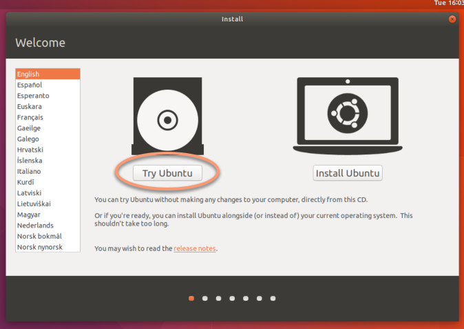
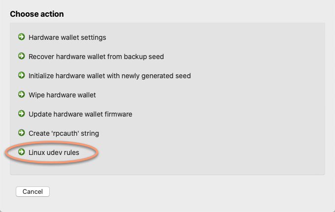
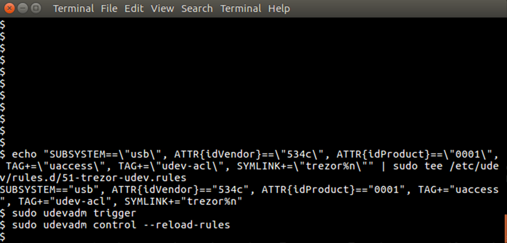

## Running DMT on an offline Linux system
For security reasons, some scenarios presented above require DMT to be run on an offline computer. Ubuntu Linux is perfectly suitable for this purpose, because the standard desktop system image can be run from a DVD or USB media (without installing it to your hard drive), and no sensitive information is left on the computer after performing the hardware wallet recovery/initialization. Follow these instructions first to create a Linux bootable DVD/USB: https://help.ubuntu.com/community/LiveCD

1. Boot your computer from the LiveCD or LiveUSB media. It is recommended to use a computer without any hard drives installed (or at least physically disconnecting any drives) and to use wired Ethernet instead of Wi-Fi for your network connection.
  Once your system boots, select the `Try Ubuntu` option:  
  
2. On the running Linux system, download the latest [Dash Masternode Tool archived binary](https://github.com/Bertrand256/dash-masternode-tool/releases) (.tar.gz) from the project page, or copy the file to the system in some other way.
3. Decompress the file by double-clicking it.
4. Disconnect the computer from the network (unplug the cable) and remove all unnecessary USB media.
5. Launch DMT.
6. Open the *Toolbox* dialog by clicking the **Toolbox** button on the main application toolbar or by choosing the *Tools->Toolbox* menu item.
7. Add the appropriate udev rules to make your hardware wallet visible on the system. For more information on how to do this, click the `see the details` link as shown in the screenshot below:  
    
  The following help window will appear:  
    
  Copy the commands appropriate to your hardware wallet type and execute them one-by one in a terminal window:  
  
8. Perform the desired hardware wallet activities (e.g. initialization or recovery).
9. Shut down the system.

