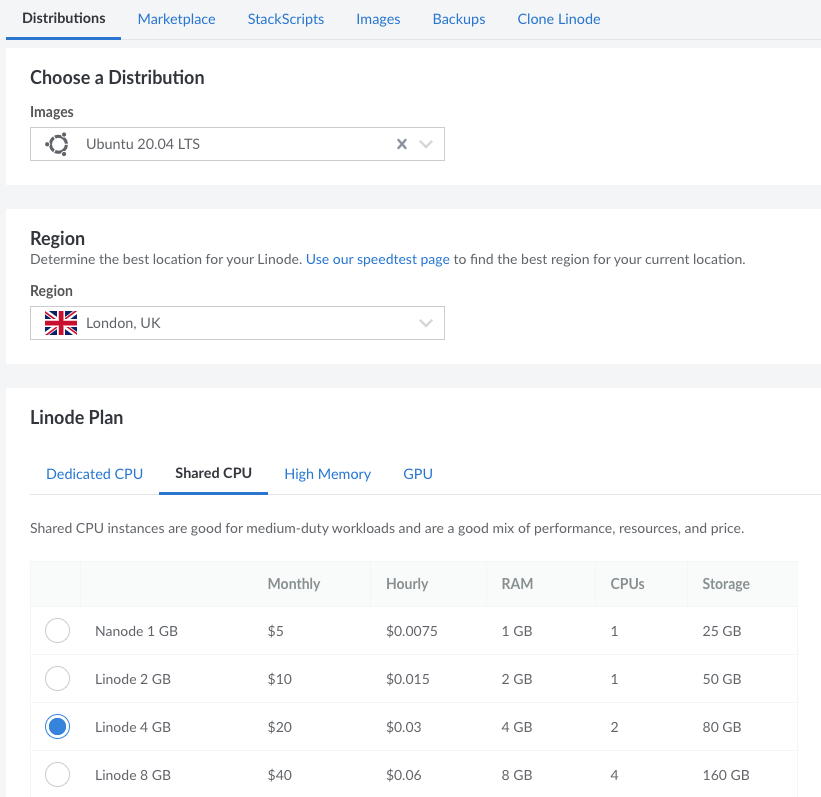
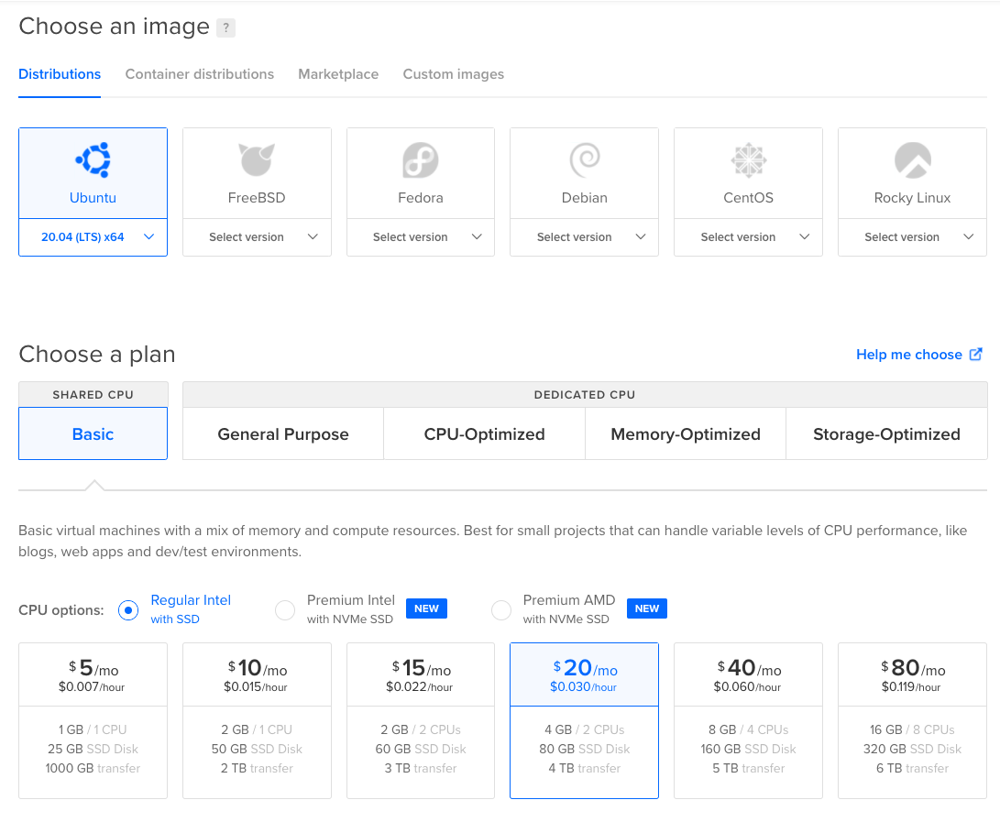

# Selecting a VPS service
There are many VPS providers, and generally speaking, the difference between them lies mainly in their reputation, stability and convenience of use. The differences in prices of products with comparable hardware parameters are small, and from the author's experience it results that a lower price almost always means lower availability/stability of the service. Taking into account that for a working masternode you receive a monthly reward of several hundred dollars and that poor service stability may cost you your place in the payment queue, differences of $10 (or less) in the monthly price of the service should not be decisive for the choice of the service.

Below are examples of several VPS providers I've dealt with over the years, along with suggested hardware configuration options currently available that should meet the requirements for the service running a Dash masternode.

> **Note**. The opinions presented here are based on my experience and what I believe is relevant to VPS services. These are my subjective opinion and other people may see these matters completely differently. In other words: the following information is clearly not (free or paid) marketing of any kind. There are many other good VPS providers out there, but since I have not personally had the opportunity to test their services, they are not included in this list.

## Provider 1: Linode
URL: https://linode.com  

Pros:  
* Very professional support.
* VPS services are very stable.
* The service management panel is "clean", fast and functional.
* Signing up will give you $100 credit to use for 60 days.
* Hourly granularity of service billing, which is perfect for testing.

Cons:
* No support for security keys like Yubikey to secure your account.

**Choosing a VPS option in Linode**
* Once you have created an account, log into it.
* Click the `Create Linode` button on the top right.
* In the `Choose a distribution` list select your preferred linux distribution. If you don't have any preferences in this area, I suggest choosing *Ubuntu 20.04 LTS*.
* In the `Region` field, select the geographical region where you want your VPS service to run from, e.g. *London, UK*.
* In the `Linode Plan` table, select the `Shared CPU` tab and then select the *Linode 4 GB* option, which will have a monthly cost of $20. If your budget is very tight, you can choose the *Linode 2 GB* option, but you have to expect that at some point in the future you will have to upgrade the option due to lack of disk space.

Linode panel for selecting VPS options:

## Provider 2: DigitalOcean
URL: https://www.digitalocean.com  

Pros:  
* VPS services are very stable.
* Service management panel is fast, functional, and I would even say nice.
* Their support is quite helpful.
* Hourly granularity of service billing, which is perfect for testing.

Cons:
* No support for security keys like Yubikey to secure your account.

**Choosing a VPS option in DigitalOcean**
* Login to your DigitalOcean account.
* Expand the `Create` list on the top right and click the `Droplets` option.
* In the `Choose an image` area, select your preferred Linux distribution. If you don't have a preference in this regard, I suggest choosing *Ubuntu 10.04 (LTS)*, which is a linux release well-supported by the Dash software. 
* In the "Choose a plan" area, select "Shared CPU/Basic", then select the "Regular Intel with SSD" option and finally choose the option with hardware configuration of 4GB RAM and 80 GB SSD (for $20/month). If your budget is very tight, you can go with 2 GB RAM and 60 GB SSD Disk, but you have to expect that at some point in the future you will have to upgrade the service due to running out of disk space.

DigitalOcean panel for selecting VPS options:

## Other VPS providers the author has dealt with

**BuyVM / Frantech**  
A platform often associated as promoting free speech, which is good.

URL: https://buyvm.net/

Pros:
* Prices are slightly lower than reputable competitors.

Cons:
* Very long time (by today's standards) from payment to service launch. In my case it varied from 24 to 48 hours, depending on whether the order was placed on a day off or not. It feels like the service is being launched manually after the purchase.
* The service preparation time is added to the paid time.
* They have a rather strange (non-standard) solution in which not only the panel for managing the payment for the service is separate from the panel for managing the service but also the accounts involved are separate.
* A rather strangely specified period of time for which you can minimally purchase the service: a full month + the time remaining to the end of the current month. So, if you buy the service in mid-February, your first bill will cover the period from that day to the end of March (i.e. 1.5 months).

**OVH**

URL: https://ovh.com

Pros:
* Prices lower than competitors.
* Support for security keys such as Yubikey to secure your account.

Cons:
* Vague, non-intuitive and sluggish service administration panel.
* Once in a while the VPS services hang in such a way that they can't be restarted from the management panel and the only solution is to ask the support for help.
* Also, once in a while, but fortunately less frequently (i.e. every dozen months or so), the disk system becomes extremely inefficient (~300kB/s read/write), which makes it virtually impossible to use the service. The only thing that helps is reinstalling the operating system and starting all from scratch.
