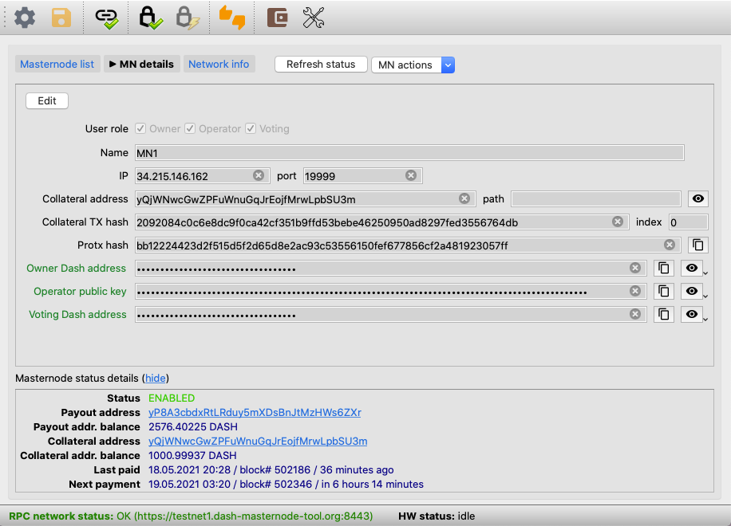
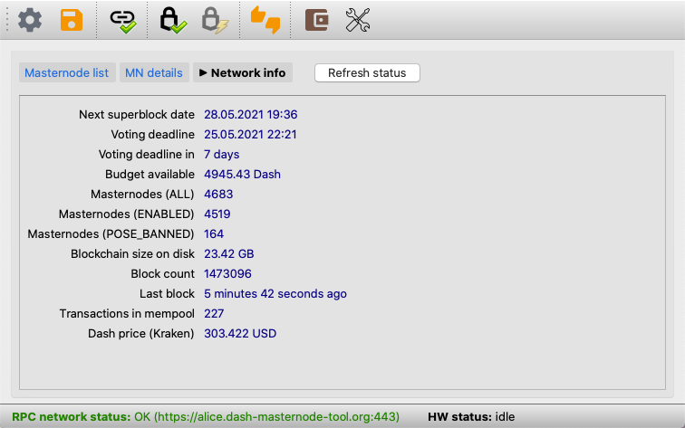
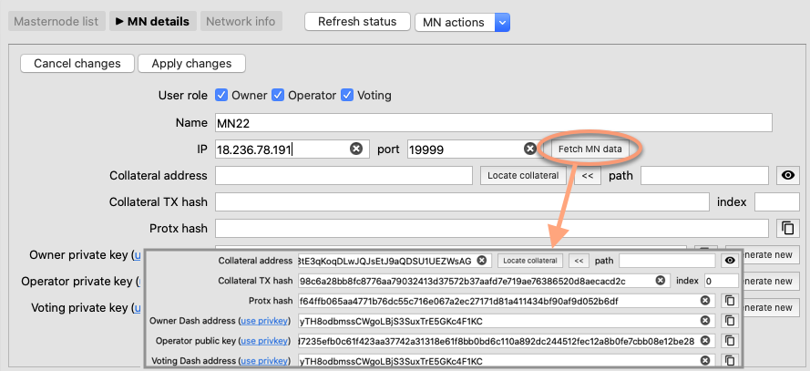
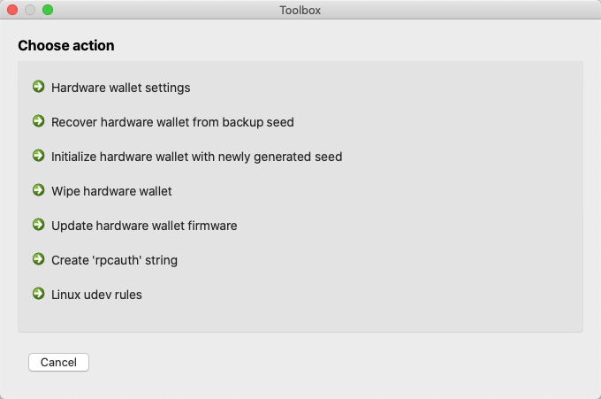
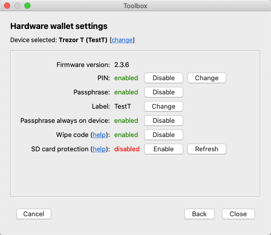
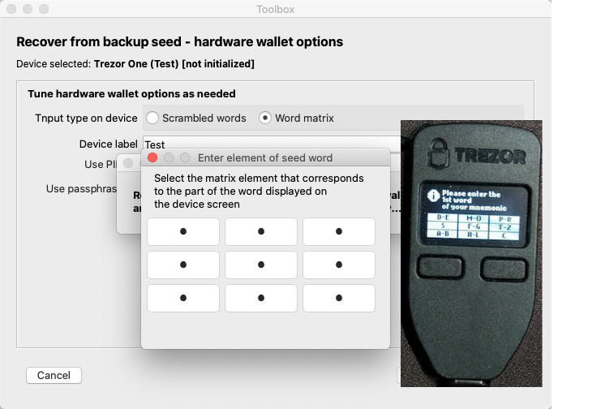
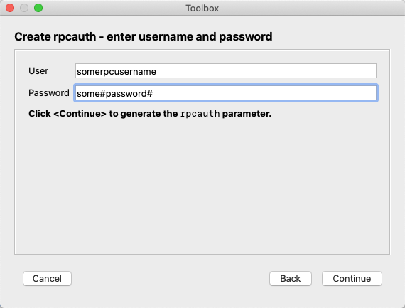
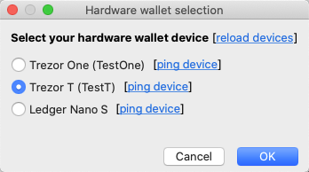

## Changes in DMT v0.27
- A new way of presenting masternode data in the main window - masternode list:  

- Masternode details moved to a separate page/view:  

- A view showing a set of information about the Dash network:  

  
- Retrieving masternode information from the Dash network based on IP/port when adding 
  a new masternode entry:  

- A new window acting as a container for all application tools (Toolbox):  

  

- Hardware wallet settings 
  - Interface for the "Passphrase always on device" option for Trezor T.
  - Interface for setting the "Wipe code" option for Trezor One/T - an additional PIN, the 
    entering of which will wipe the device memory ([details](https://wiki.trezor.io/User_manual:Wipe_code)).
  - Interface for configuring an additional method of securing Trezor T devices - an SD 
    card that must be present to start the device ([details](https://wiki.trezor.io/User_manual:SD_card_protection)).

  

  
- Interface to the wallet seed recovery method for Trezor One with increased security, based on the word matrix:    

 
 
- Tool to help creating the "rpcauth" string, which allows starting RPC interface on a server without leaving 
  password to the interface on the server:  

  
- Removing the strict setting of the hardware wallet type in the app configuration in favor of the dynamic selection 
  of the device from the currently connected ones:  

  

- Adapting to the latest versions of communication libraries for Trezor, Keepkey and Ledger and 
  for PyQt.

- Adapting communication module to Dash v0.17
  
- Other, numerous improvements and fixes.