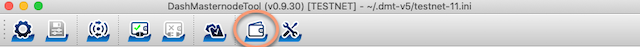
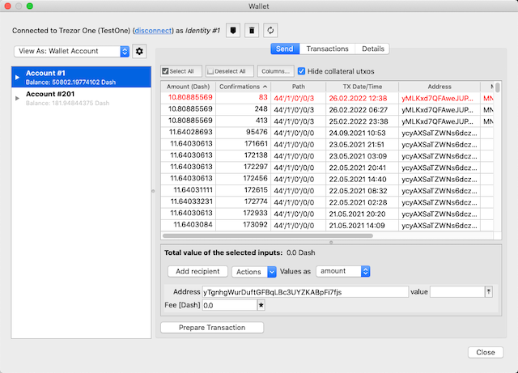
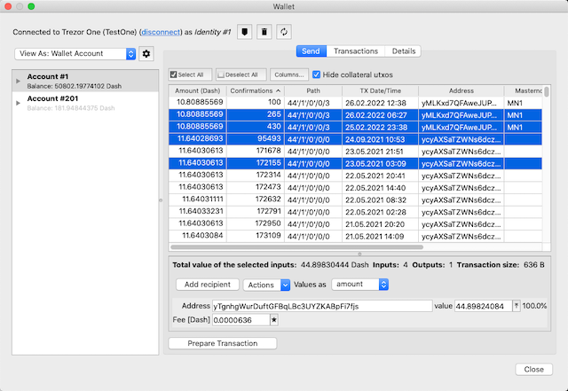
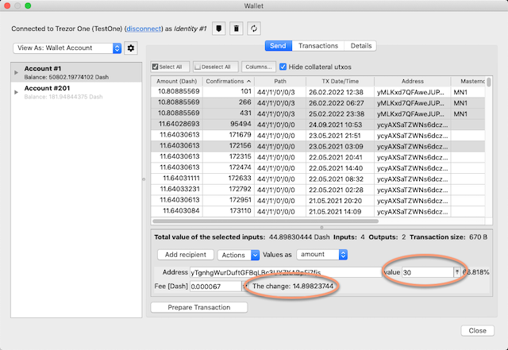
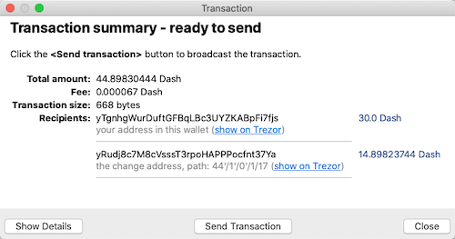
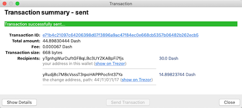

# Graphical interface to hardware wallets

DMT allows you to transfer your masternode earnings in a safe way. Unlike the official applications of hardware wallet manufacturers, DMT gives you a 100% control over which *unspent transaction outputs* (UTXO) you want to transfer. This has the same effect as the *Coin control* functionality implemented in the *Dash Core* wallet.

The general idea behind the wallet's functionality is that it displays individual UTXOs (aka coins) and this is what sets it apart from all other applications of this type. This is done on purpose because it gives you more control over which UTXO you spend, which may be quite important for transferring masternode earnings than for "normal" uses.

This functionality can be started from the main application toolbar by clicking the *wallet* button:

The wallet window allows you to display transactions in two main views:
- masternode view
- the whole wallet view

All collateral UTXOs (worth 1000 Dash) are initially hidden to avoid unintentionally spending collateral funds and thus breaking the associated masternode. You can show these hidden entries by unchecking the `Hide collateral UTXOs` option.

> **Note**. Rows with a red font in the *Confirmations* column and a gray background are related to so-called *coinbase* transactions, that don't have the required number of confirmations to spend them. You should restrain from sending them and instead wait until they have received at least 100 confirmations. 

To send some funds from your wallet, select the UTXOs (coins) to be included in the transaction:

It is worth noting that you do not have to send the entire amount which is the sum of all the UTXOs you have selected. You can reduce this value to the desired level by editing it manually, wich will cause the remainder to be returned to one of the so-called change addresses from your hardware wallet:  

Once you have entered your target addresses and amounts, by clicking **Prepare Transaction** you can go to the next step, which will be signing transaction with your hardware.

> **Note 1**. At this point, I would like to emphasize the necessity of carefully reading the messages on the hardware wallet screen before confirming the transaction with the physical button of the device. Ony this will protect your funds from your mistake like entering an incorrect destination address or from malware activities that may be running on your computer.  
> 
> **Note 2**. Signing a transaction with hardware wallet does not result in the transaction being automatically broadcasted to the Dash network. Before this happens, DMT will show you a confirmation window where you will have the option to cancel the process.

After signing the transaction with your hardware wallet, the application will display a summary and will ask you for confirmation for broadcasting the signed transaction to the Dash network:  

After clicking `Send Transaction`, the application broadcasts the transaction and then shows a confirmation with a transaction ID as a hyperlink directing to a Dash block explorer:  
